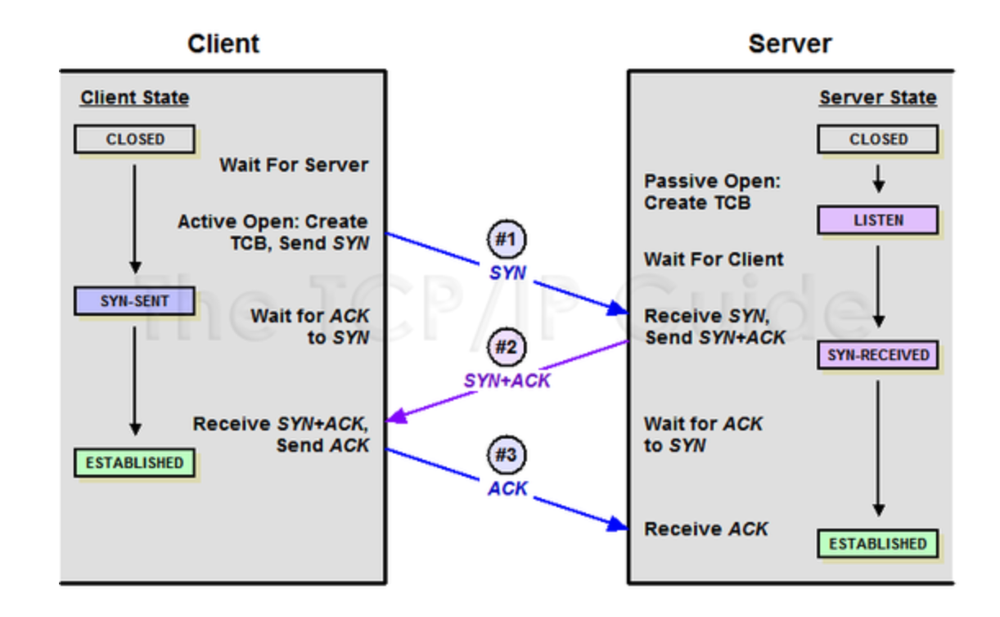

# 🔑 TCP 3-way handshake

 

## 📌 What is 3-way handshake

TCP が属している Transport Layer は、二つのホスト間が連結され、最終的な目的地までデータを伝達する機能を果たす。 
TCPで連結指向的な特性を持たせる過程が、3-way-handshake方式です。

具体的にはTCP/IP プロトコルを利用して通信をするアプリケーションがデータを伝送する前に、
正確な転送を保障するため、相手のコンピュータと事前にセッションを設立するプロセスを意味します。

Client → Server : TCP SYN 
Server → Client : TCP SYN ACK 
Client → Server : TCP ACK 

* SYN : synchronize sequence numbers
* ACK : acknowledgment

 

## 📌 TCP Header / Message Format

● Source Port / Destination Port: 
Source Portはメッセージを送る側から使用されるPort番号で、Destination Portはメッセージを受ける側のPort番号です。
これとともに、IPヘッダーにあるSource address / Destination Addressを利用すれば、唯一識別される通信接続を作ることができるようになります。

● Sequence Number: 
TCPセグメント内のデータの送信バイト流れの位置を指します。
別のホストに送信されるパケットは、複数の異なる経路を通じて送信されているため、パケットの順序が前後する可能性があります。 これを受信側は再組み立てする必要がありますが、この時、Sequence Numberを利用して組み立てることになります。

● Acknowledgment Number: 
以下に受け取ることが予想されるデータの順序番号

● Reserved: 
現在は使用しておりませんが、今後のために予約されたフィールド

● TCP Flags:

- Flag順序

  |URG|ACK|PSH|RST|SYN|FIN|
  |---|---|---|---|---|---|

- SYN（Synchronization）:TCP でセッションを成立する時、最初に送信するパケット、シーケンス番号を任意に設定してセッションを接続するために使用される（初期にはシーケンス番号を送信します。)

- ACK(Acknowledgement):相手からパケットを受け取ったことを知らせるパケットです。 
  受信者が送信者のシーケンス番号にTCP 階層で長さまたはデータ量を足したものと同じACK を送信します（通常+1 して送信）。ACK 応答を通じて送信したパケットの成功、失敗を判断して再送信するか、次のパケットを送信します。

- RST(Reset) では、セッションの正常な接続切断に該当します。 
  このパケットを送信先が現在接続しているところと即時に接続を切断する際に使用、つまり接続が確立した回線に強制的にリセットを要請することです。

- PSH(Push):受信データを直ちに目的地のOSI 7 LayerのApplication階層に転送するFLAG。 
  対話型トラフィックで使用されるもので、バッファが満たされるのを待たずにデータを伝達します。 データはバッファリングなしで、すぐ上の階層ではなく7階層のアプリケーションに伝達します。

- URG（Urgent）:Urgent pointer 有効なものであることを示します。 
  Urgent pointer とは、緊急性を示しますが、これらのフラグが有効である場合、他のパケットよりもそのパケットを先に処理するよう要請することになります。

- FIN（Finish）:接続終了要請のセッション接続を終了させる時に使用され、これ以上転送するデータがないことを示します。 

 

## 📌 3-way handshake役割

TCP/IP プロトコルを利用して通信をするアプリケーションプログラムが、データを伝送する前に正確な伝送を保障するために相手と事前にセッションを設立する過程で、両方ともデータを伝送する準備ができたことを保障するものです。 

 

## 📌 3-way handshake過程

1. SYNセグメント:　クライアントは、Source portに自分を表すport numberを入れ、Destination portにはサーバーを指すport numberを入れます。 Sequence numberにはクライアントの初期順序番号、Acknowledgment numberには0、FlagはSYN bitを1に設定して送信します。
2. SYN+ACKセグメント:　サーバーはSource portに自分を表すport numberを入れ、Destination portには送信者を表すport numberを入れます。 Sequence numberにはサーバーの初期順序番号、Acknowledgment numberには「クライアントの初期順序番号+1」の値を入れて、FlagはSYNとACK bitをすべて1に設定して送信します。
3. ACKセグメント:　1番のクライアントと同じようにSource portとDestination portを設定し、Acknowledgment numberには「サーバーの初期順序番号+1」の値を入れて、FlagはACK bitを1に設定して送信します。

このような方式で通信することが信頼できる連結である3-Way-Handshaking方式です。

 

---

📚 参考 :  
[https://ko.wikipedia.org/wiki/%ED%95%B8%EB%93%9C%EC%85%B0%EC%9D%B4%ED%82%B9](https://ko.wikipedia.org/wiki/%ED%95%B8%EB%93%9C%EC%85%B0%EC%9D%B4%ED%82%B9)
 
[https://sleepyeyes.tistory.com/4](https://sleepyeyes.tistory.com/4)
 
[https://haruhiism.tistory.com/10](https://haruhiism.tistory.com/10)
 
[https://mindnet.tistory.com/entry/%EB%84%A4%ED%8A%B8%EC%9B%8C%ED%81%AC-%EC%89%BD%EA%B2%8C-%EC%9D%B4%ED%95%B4%ED%95%98%EA%B8%B0-22%ED%8E%B8-TCP-3-WayHandshake-4-WayHandshake](https://mindnet.tistory.com/entry/%EB%84%A4%ED%8A%B8%EC%9B%8C%ED%81%AC-%EC%89%BD%EA%B2%8C-%EC%9D%B4%ED%95%B4%ED%95%98%EA%B8%B0-22%ED%8E%B8-TCP-3-WayHandshake-4-WayHandshake)
 
[https://mindgear.tistory.com/206](https://mindgear.tistory.com/206)
 
[https://blog.daum.net/tlos6733/47](https://blog.daum.net/tlos6733/47)
 
[https://www.youtube.com/watch?v=ikDVGYp5dhg&t=785s](https://www.youtube.com/watch?v=ikDVGYp5dhg&t=785s)