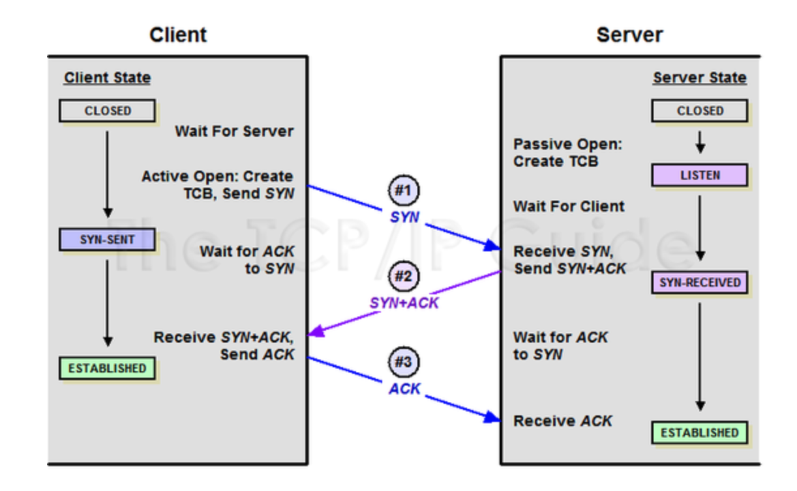

# 🔑 TCP 3-way handshake

 

## 📌 What is 3-way handshake

TCP가 속해있는 Transport Layer는 두 호스트 간에 녀결을 맺고 최종적인 목적지까지 데이터를 전달하는 기능을 한다. 
TCP에서 연결지향적인 특성을 갖게 해주는 과정이 3-way handshake 방식이다.

구체적으로는 TCP/IP 프로토콜을 이용해서 통신을 하는 응용프로그램이 데이터를 전송하기 전에, 
정확한 전송을 보장하기 위해 상대방 컴퓨터와 사전에 세션을 수립하는 과정을 의미

Client → Server : TCP SYN 
Server → Client : TCP SYN ACK 
Client → Server : TCP ACK 

* SYN : synchronize sequence numbers
* ACK : acknowledgment

 

## 📌 TCP Header / Message Format

● Source Port / Destination Port: 
Source Port는 메시지를 보내는 측에서 사용되는 Port 번호이며, Destination Port는 메시지를 받는 측의 Port 번호이다. 
이와 더불어 IP 헤더에 있는 Source address / Destination Address 를 이용하면 유일하게 식별되는 통신 연결을 만들 수 있게 된다.

● Sequence Number: 
TCP 세그먼트 안의 데이터의 송신 바이트 흐름의 위치를 가리킨다. 
다른 호스트로 전달되는 패킷은 여러 개의 서로 다른 경로를 거치면서 전달되다 보니 패킷의 순서가 뒤바뀔 수 있다. 이를 수신 측에서는 재 조립해야 할 필요가 있는데 이 때 Sequence Number를 이용하여 조립하게 된다

● Acknowledgment Number: 
다음에 받을 것으로 예상되는 데이터의 순서 번호

● Reserved: 
현재는 사용하지 않지만, 나중을 위해서 예약된 필드

● TCP Flags: 

- Flag 순서

  |URG|ACK|PSH|RST|SYN|FIN|
  |---|---|---|---|---|---|

- SYN(Synchronization): TCP 에서 세션을 성립할 때 가장먼저 보내는 패킷, 시퀀스 번호를 임의적으로 설정하여 세션을 연결하는 데에 사용된다(초기에는 시퀀스 번호를 보낸다.)

- ACK(Acknowledgement): 상대방으로부터 패킷을 받았다는 걸 알려주는 패킷. 
  받는 사람이 보낸 사람 시퀀스 번호에 TCP 계층에서 길이 또는 데이터 양을 더한 것과 같은 ACK를 보냅니다.(보통 +1 하여 보냄) ACK 응답을 통해 보낸 패킷에 대한 성공, 실패를 판단하여 재전송 하거나 다음 패킷을 전송

- RST(Reset)비 정상적인 세션 연결 끊기에 해당한다. 
  이 패킷을 보내는 곳이 현재 접속하고 있는 곳과 즉시 연결을 끊고자 할 때 사용, 즉 연결이 확립된 회선에 강제로 리셋을 요청하는 것

- PSH(Push): 받은 데이터를 즉시 목적지인 OSI 7 Layer 의 Application 계층으로 전송하도록 하는 FLAG. 
  대화형 트랙픽에 사용되는 것으로 버퍼가 채워지기를 기다리지 않고 데이터를 전달한다. 데이터는 버퍼링 없이 바로 위 계층이 아닌 7 계층의 응용프로그램으로 바로 전달한다.

- URG(Urgent): Urgent pointer 유효한 것인지를 나타낸다. 
  Urgent pointer란 긴급한 정도를 나타내는데, 이 플래그가 유효하다면 다른 패킷보다 해당패킷을 먼저 처리하도록 요청할 것이다.

- FIN(Finish): 연결 종료 요청 세션 연결을 종료시킬 때 사용되며 더이상 전송할 데이터가 없음을 나타낸다. 

 

## 📌 3-way handshake 역할

TCP/IP 프로토콜을 이용해서 통신을 하는 응용프로그램이 데이터를 전송하기전, 정확한 전송을 보장하기위해 상대방과 사전에 세션을 수립하는 과정으로, 양쪽 모두 데어터를 전송할 준비가 되었다는 것을 보장하는 것이다. 

---

📚 참고 :  
[https://ko.wikipedia.org/wiki/%ED%95%B8%EB%93%9C%EC%85%B0%EC%9D%B4%ED%82%B9](https://ko.wikipedia.org/wiki/%ED%95%B8%EB%93%9C%EC%85%B0%EC%9D%B4%ED%82%B9)
 
[https://sleepyeyes.tistory.com/4](https://sleepyeyes.tistory.com/4)
 
[https://haruhiism.tistory.com/10](https://haruhiism.tistory.com/10)
 
[https://mindnet.tistory.com/entry/%EB%84%A4%ED%8A%B8%EC%9B%8C%ED%81%AC-%EC%89%BD%EA%B2%8C-%EC%9D%B4%ED%95%B4%ED%95%98%EA%B8%B0-22%ED%8E%B8-TCP-3-WayHandshake-4-WayHandshake](https://mindnet.tistory.com/entry/%EB%84%A4%ED%8A%B8%EC%9B%8C%ED%81%AC-%EC%89%BD%EA%B2%8C-%EC%9D%B4%ED%95%B4%ED%95%98%EA%B8%B0-22%ED%8E%B8-TCP-3-WayHandshake-4-WayHandshake)
 
[https://mindgear.tistory.com/206](https://mindgear.tistory.com/206)
 
[https://blog.daum.net/tlos6733/47](https://blog.daum.net/tlos6733/47)