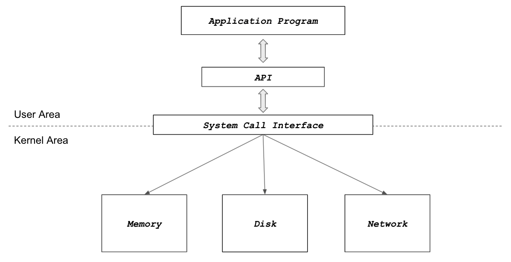

# 🔑 사용자와 커널 모드

<br>

## 📌 CPU Protection Rings

● CPU도 권한 모드라는 것을 가지고 있습니다.
```
○ 사용자 모드(user mode by applications)
○ 커널 모드(kernel mode by OS): 특권 명령어 실행과 원하는 작업 수행을 위한 자원 접근을 가능케 하는 모드
```
● 링 별 사용 대상
```
○ Level 0: Kernel
○ Level 1, 2: OS Service
○ Level 3: Application Program
```
● 두 가지 모드
```
○ 사용자 모드 (user mode): 응용 프로그램이 사용
○ 커널 모드(kernel mode): OS가 사용
```
<br>


<br>

## 📌 Application Program and OS

● 커널 모드에서만 실행 가능한 기능들이 있음<br>
● 커널 모드로 실행하려면, 반드시 시스템 콜을 사용해야함(거쳐야 함)<br>
● 시스템 콜은 운영체제 제공<br>
<br>



<br>

## 📌 사용자 모드와 커널 모드

● 함부로 응용 프로그램이 전체 컴퓨터 시스템을 헤치지 못함<br>
● 주민등록등본은 꼭 동사무소 또는 민원24시(정부 사이트)에서 특별한 신청서를 써야만 발급
```
○ 동사무소 직원분들은 특별한 권한을 가지고, 주민등록등본 출력 명령을 실행
```

<br>

## 📌 정리

● 운영체제는 시스템 콜 제공<br>
● 프로그래밍 언어별로 운영체제 기능을 활용하기 위해, 시스템 콜을 기반으로 API 제공<br>
● 응용 프로그램은 운영체제 기능 필요시, 해당 API를 사용해서 프로그램을 작성<br>
● 응용 프로그램이 실행되서, 운영체제 기능이 필요한 API를 호출하면, 시스템 콜이 호출되서, 커널모드로 변경되어 OS 내부에서 해당 명령이 실행되고, 다시 응용 프로그램으로 돌아간다.<br>


<br>
<br>

---

##### 📚 참고강의：[컴퓨터 공학 전공 필수 올인원 패키지 Online](https://fastcampus.co.kr/dev_online_cs)