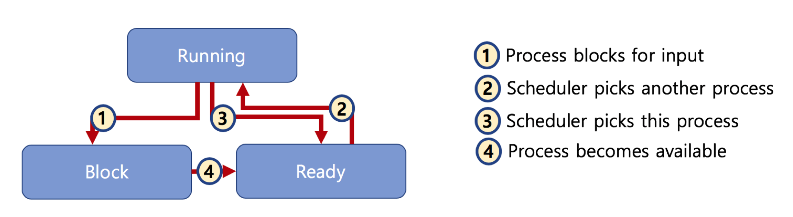

# 🔑 process state

 

## 📌 マルチプログラミングとWait

● マルチプログミング: CPU活用度を極大化するスケジュリングアルゴリズム 
● Wait: 簡単に保存媒体からファイルの読み込みを待つ時間に指定します 

 

## 📌 プロセスの状態。

● running state: 現在のCPUで実行状態 
● ready state: CPUで実行可能状態（実行待機状態） 
● block state: 特定のイベント発生待機状態（例:プリンティングが終わりました！) 

 

 
 

---

📚 参考講義：[コンピューター工学専攻必須オールインワンパッケージOnline](https://fastcampus.co.kr/dev_online_cs)