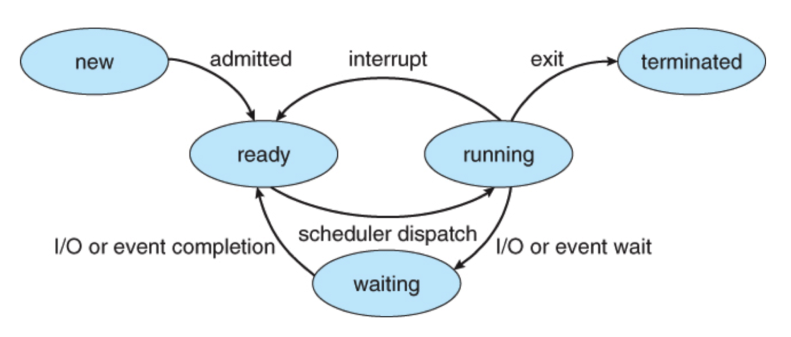
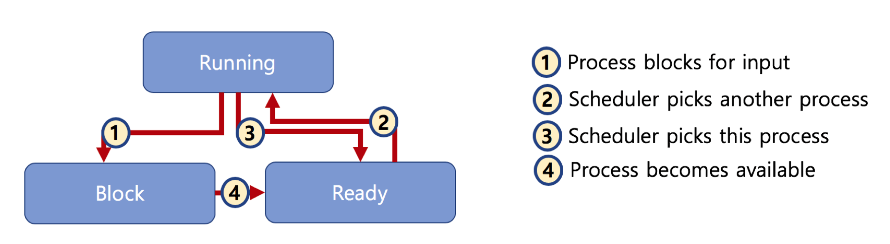

# 🔑 Preemptive and Non-preemptive Scheduling

<br>

## 📌 Preemptive and Non-preemptive Scheduler

● Preemptive Scheduling
```
○ 一つのプロセスが他のプロセスの代わりにプロセッサー(CPU)を占めることができます。
```
● Non-preemptive Scheduling
```
○ 1つのプロセスが終わらないと他のプロセスはCPUを使用できません
```

<br>

## 📌 Preemptive and Non-preemptive Schedulerの差

● Non-preemptive Scheduler
```
○ プロセスが自発的にblocking 状態に入るか、実行が終わった時のみ、別のプロセスに切り替え可能
```



● Preemptive Scheduler
```
○ プロセスrunning中にスケジューラーがこれを中断させ、他のプロセスに交換可能です。
```



<br>

## 📌 スケジューラー区分です

● FIFO(FCFS)、SJF、Priority-basedはどのプロセスを先に実行させるかについてのアルゴリズム<br>
● Round Robinは時分割システムのための基本アルゴリズム(Preemptive Scheduler)<br>

<br>

##📌 マウス / キーボード反応が遅い場合

● リナックススケジューラー:O(1)、CFSのように様々な方法に変更を検討中
```
○ インタラクティブ、IO、CPU 中心プロセスにあらかじめ区分できれば、より改善されたスケジューリングが可能
```

<br>
<br>

---

📚 参考講義：[コンピューター工学専攻必須オールインワンパッケージOnline](https://fastcampus.co.kr/dev_online_cs)