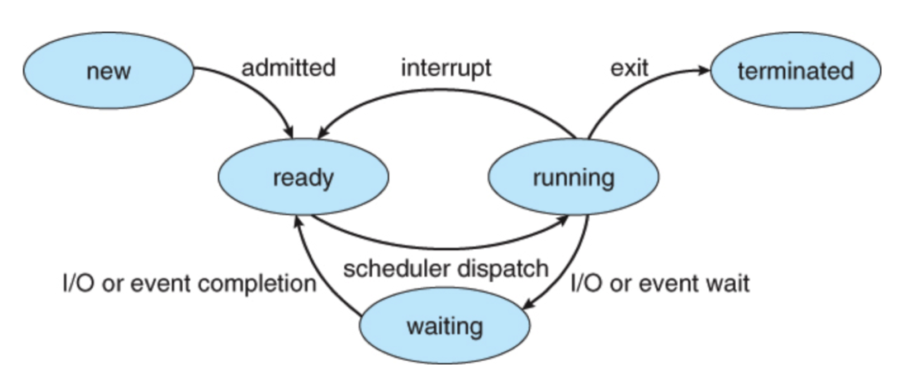
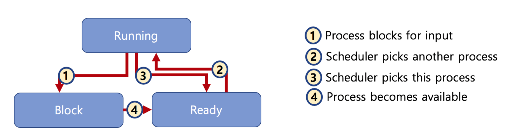

# 🔑 Preemptive and Non-preemptive Scheduling

<br>

## 📌 Preemptive and Non-preemptive Scheduler

● Preemptive Scheduling
```
○ 하나의 프로세스가 다른 프로세스 대신에 프로세서(CPU)를 차지할 수 있음
```
● Non-preemptive Scheduling
```
○ 하나의 프로세스가 끝나지 않으면 다른 프로세스는 CPU를 사용 할 수 없음
```

<br>

## 📌 Preemptive and Non-preemptive Scheduler 차이

● Non-preemptive Scheduler
```
○ 프로세스가 자발적으로 blocking 상태로 들어가거나, 실행이 끝났을 때만, 다른 프로세스로 교체 가능
```



● Preemptive Scheduler
```
○ 프로세스 running 중에 스케쥴러가 이를 중단시키고, 다른 프로세스로 교체가능
```



<br>

## 📌 스케쥴러 구분

● FIFO(FCFS), SJF, Priority-based는 어떤 프로세스를 먼저 실행시킬지에 대한 알고리즘<br>
● RoundRobin은 시분할 시스템을 위한 기본 알고리즘(Preemptive Scheduler)<br>

<br>

## 📌 랙? 마우스 / 키보드 반응이 느린 경우?

● 리눅스 스케쥴러: O(1), CFS와 같이 다양한 방식으로 변경시도중
```
○ 인터렉티브, IO, CPU 중심 프로세스로 미리 구분할 수 있가면 보다 개선된 스케쥴링 가능함
```

<br>
<br>

---

##### 📚 참고강의：[컴퓨터 공학 전공 필수 올인원 패키지 Online](https://fastcampus.co.kr/dev_online_cs)