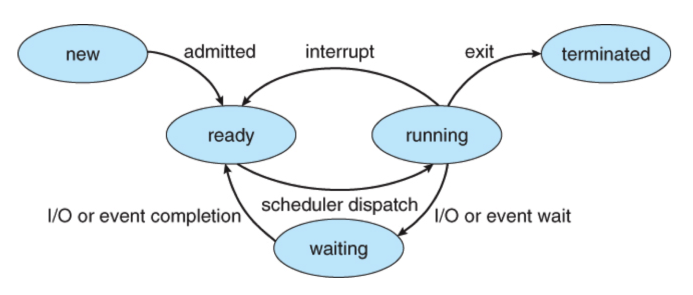
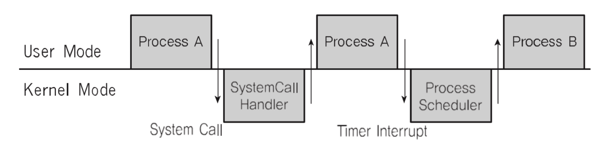

# 🔑 Interrupt

<br>

## 📌 Interruptとは？

● CPUがプログラムを実行している際、入出力ハードウェアなどの装置や例外状況が発生し、処理が必要な場合にCPUに通知して処理する技術

<br>

## 📌 Interruptが必要な理由

● Preemptive Scheduler 実装
```
○ プロセスrunning中にスケジューラーがこれを中断させ、他のプロセスに置き換えるため、現在プロセスを実行を中断させます。
  - そのためには、スケジューラーコードが実行になり、現在のプロセス実行を中止させなければなりません。
```

● IO Deviceとのコミュニケーション
```
○ 保存媒体でデータを処理完了する際、プロセスを起こす必要があります(block state -> ready state)
```

● 例外状況 ハンドリング
```
○ CPUがプログラムを実行している時、入出力ハードウェアなどの装置やまたは例外状況が発生する場合、CPUが当該処理ができるようにCPUに通知しなければなりません。
```



<br>

## 📌 Interrupt処理例

● CPUがプログラムを実行している場合、入出力ハードウェアなどのデバイスイシューが発生します
```
○ ファイル処理が終わったということをOSに知らせる
○ OSは、当該プロセスをblock stateから実行待機(ready)状態にプロセスの状態を変更します。
```
● CPUがプログラムを実行している場合、例外状況が発生します
```
○ 0で割る計算が発生し、例外発生をOSに知らせる
○ OSが当該プロセスを実行中止 / エラーを表示します
```

<br>

###📌Event And Interrupt

● Interruptは一種イベントと呼ばれます<br>
● イベントに合わせてOSが処理<br>

<br>

## 📌 主なInterrupt

● 1. Divide-by-Zero Interrupt
```
#include <stdio.h>

int main()
{
    int data;
    int divider = 0;
    data = 1 / divider; // interrupt
    return 0;
}
```

● 2. Timer Interrupt
```
○ ハードウェロから一定時間ごとにタイマーinterruptをosに通知します。
```

● 3. IO Interrupt
```
○ Printer
○ Keyboard
○ Mouse
○ SSD
```

<br>

## 📌 Interrupt種類

● Inner Interrupt
```
○ 主にプログラム内部で誤った命令または誤ったデータ使用時に発生します
  - 0で分けたとき
  - ユーザーモードで許可されていない命令または空間にアクセスします。
  - 計算結果がOverflow / Underflowです。
```
● External Interrupt
```
○ 主にハードウェアで発生するイベントです。
  - 電源以上
  - 機械問題
  - キーボードなど、IO関連イベント
  - Timerイベント
```
● 内部interruptは主にプログラム内部で発生するので、ソフトウェアinterruptとも呼ばれる<br>
● 外部interruptは主にハードウェアにおいて発生するため、ハードウェアinterruptとも呼ばれる<br>

<br>

## 📌 System Call Interrupt

● システムコール実行のためには強制的にコードにinterrupt命令を入れ、CPUに実行させなければなりません。<br>
● システムコール実際コード
```
moveax, / eax レジスタにシステムコール番号を入れます(ex1)
movebx, / ebx レジスタには、システムコールに相当する因子値を入れます（ex 0）
int 0x80 / ソフトウェアinterruptを呼び出し、0x80値を取得
```

<br>

## 📌 Interrupt And System Call (고급)

●システムコールinterrupt命令を呼び出しながら0x80の値を渡す
```
○ 1. CPUはユーザーモードをカーネルモードに切り替えます
○ 2. IDT（Interrupt Descriptor Table）で0x80に該当するアドレス（関数）を探して実行する
○ 3. system_call() 関数から eaxでシステムコール番号を探し、該当する番号に合うシステムコール関数に移動します。
○ 4. 該当システムコール関数実行後、再びカーネルモードからユーザーモードに変更し、再び該当プロセスの次のコードを進行
```

<br>

## 📌 User / Kernel Mode and Process, Interrupt



<br>

## 📌 Interrupt And IDT

● interruptは予め定義され、それぞれに番号と実行コードを示す住所が記されています
```
○ Where ? IDT(Iterrupt Descriptor Table)に記録
○ When? コンピュータ起動時のOSが記録
○ Which Code? OS内部コード
```
● EX
```
○ 常にinterrupt発生時、IDTを確認
○ システムコールinterrupt命令は、0x80の番号を予め定義
○ interrupt 0x80に該当するOSコードはsystem_call（）という関数です。
○ つまり、IDTには0x80 -> system_call() のような情報が記録されています。
```
● Linux EX
```
○ 0 ~ 31: 例外状況interrupt (一部は定義されないまま残されています)
○ 32 ~ 47: ハードウェアinterrupt（周辺装置の種類 / 本数に応じて変更可能）
○ 128: システムコール。
```

<br>

## 📌 Interrupt And Process

● 1. プロセス実行中にinterruptが発生<br>
● 2. 現プロセス実行中断<br>
● 3. interrupt処理関数実行(OS)<br>
● 4. 現プロセス再実行<br>

<br>

## 📌 Interrupt And Scheduler

● 頻繁にタイマーinterruptが発生
```
○ OSがタイマinterruptの発生回数を記憶して、5タイマーinterruptが発生すると、現在のプロセスを別のプロセスに切り替える
```

<br>
<br>

---

📚 参考講義：[コンピューター工学専攻必須オールインワンパッケージOnline](https://fastcampus.co.kr/dev_online_cs)