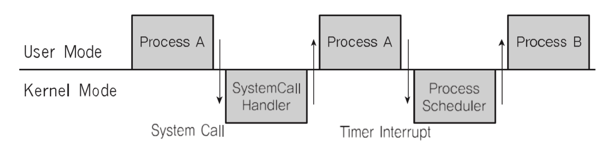

# 🔑 Interrupt

<br>

## 📌 인터럽트란?

● CPU가 프로그램을 실행하고 있을 때, 입출력 하드웨어 등의 장치나 또는 예외상황이 발생하여 처리가 필요할 경우에 CPU에 알려서 처리하는 기술

<br>

## 📌 Interrupt 필요 이유

● Preemptive Scheduler 구현
```
○ 프로세스 running 중에 스케쥴러가 이를 중단시키고, 다른 프로세스로 교체하기 위해, 현재 프로세스 실행을 중단시킴
  - 그러려면, 스케쥴러 코드가 실행이 되서, 현 프로세스 실행을 중지시켜야 함
```

● IO Device와의 커뮤니케이션
```
○ 저장매체에서 데이터 처리 완료시, 프로세스를 깨워야 함 (block state -> ready state)
```

● 예외 상황 핸들링
```
○ CPU가 프로그램을 실행하고 있을 때, 입출력 하드웨어 등의 장치나 또는 예외상황이 발생할 경우, CPU가 해당 처리를 할 수 있도록 CPU에 알려줘야 함
```


<br>

## 📌 Interrupt 처리 예

● CPU가 프로그램을 실행하고 있을 때 입출력 하드웨어 등의 장치 이슈 발생
```
○ 파일 처리가 끝났다는 것을 운영체제에 알려주기
○ 운영체제는 해당 프로세스를 block state에서 실행 대기(ready) 상태로 프로세스 상태 변경하기
```
● CPU가 프로그램을 실행하고 있을 때 예외 상황이 발생
```
○ 0으로 나누는 계산이 발생해서, 예외 발생을 운영체제에 알려주기
○ 운영체제가 해당 프로세스 실행 중지 / 에러 표시
```

<br>

## 📌 이벤트와 인터럽트

● 인터럽트는 일종의 이벤트로 불림<br>
● 이벤트에 맞게 운영체제가 처리<br>

<br>

## 📌 주요 Interrupt

● 1. Divide-by-Zero Interrupt
```
#include <stdio.h>

int main()
{
    int data;
    int divider = 0;
    data = 1 / divider; // interrupt
    return 0;
}
```

● 2. Timer Interrupt
```
○ 하드웨로로부터 일정 시간마다 타이머 인터럽트를 운영체제에 알려줌
```

● 3. IO Interrupt
```
○ Printer
○ Keyboard
○ Mouse
○ SSD
```

<br>

## 📌 인터럽트 종류

● Inner Interrupt
```
○ 주로 프로그램 내부에서 잘못된 명령 또는 잘못된 데이터 사용시 발생
  - 0으로 나눴을 때
  - 사용자 모드에서 허용되지 않은 명령 또는 공간 접근시
  - 계산 결과가 Overflow / Underflow
```
● External Interrupt
```
○ 주로 하드웨어에서 발생되는 이벤트
  - 전원 이상
  - 기계 문제
  - 키보드등 IO관련 이벤트
  - Timer 이벤트
```
● 내부 인터럽트는 주로 프로그램 내부에서 발생하므로, 소프트웨어 인터럽트라고도 함<br>
● 외부 인터럽트는 주로 하드웨에서 발생하므로, 하드웨어 인터럽트라고도 함<br>

<br>

## 📌 System Call Interrupt

● 시스템콜 실행을 위해서는 강제로 코드에 인터럽트 명령을 넣어, CPU에게 실행시켜야 한다.<br>
● 시스템 콜 실제 코드
```
mov eax, // eax 레지스터에 시스템 콜 번호를 넣는다 (ex 1)
mov ebx, // ebx 레지스터에는 시스템 콜에 해당하는 인자값을 넣는다 (ex 0)
int 0x80 // 소프트웨어 인터럽트 명령을 호출하면서 0x80값을 넘겨줌
```

<br>

## 📌 Interrupt And System Call (고급)

● 시스템콜 인터럽트 명령을 호출하면서 0x80값을 넘겨줌
```
○ 1. CPU는 사용자 모드를 커널 모드로 바꿈
○ 2. IDT(Iterrupt Descriptor Table)에서 0x80에 해당하는 주소(함수)를 찾아서 실행함
○ 3. system_call() 함수에서 eax로부터 시스템 콜 번호를 찾아서, 해당 번호에 맞는 시스템콜 함수로 이동
○ 4. 해당 시스템 콜 함수 실행 후, 다시 커널모드에서 사용자 모드로 변경하고, 다시 해당 프로세스 다음 코드 진행
```

<br>

## 📌 User / Kernel Mode and Process, Interrupt



<br>

## 📌 인터럽트와 IDT

● 인터럽트는 미리 정의되어 각각 번호와 실행 코드를 가리키는 주소가 기록되어 있음
```
○ Where ? IDT(Iterrupt Descriptor Table)에 기록
○ When ? 컴퓨터 부팅시 운영체제가 기록
○ Which Code ? 운영체제 내부 코드
```
● EX
```
○ 항상 인터럽트 발생시, IDT를 확인
○ 시스템콜 인터럽트 명령은 0x80 번호가 미리 정의
○ 인터럽트 0x80에 해당하는 운영체제 코드는 system_call()이라는 함수
○ 즉, IDT에는 0x80 -> system_call() 와 같은 정보가 기록되어 있음
```
● Linux EX
```
○ 0 ~ 31: 예외상황 인터럽트 (일부는 정의 안된 채로 남겨져 있음)
○ 32 ~ 47: 하드웨어 인터럽트 (주변장치 종류 / 갯수에 따라 변경가능)
○ 128: 시스템 콜
```

<br>

## 📌 Interrupt And Process

● 1. 프로세스 실행중 인터럽트 발생<br>
● 2. 현 프로세스 실행 중단<br>
● 3. 인터럽트 처리 함수 실행(운영체제)<br>
● 4. 현 프로세스 재실행<br>

<br>

## 📌 Interrupt And Scheduler

● 수시로 타이머 인터럽트 발생
```
○ 운영체제가 타이머 인터럽트 발생 횟수를 기억해서 5번 타이머 인터럽트 발생하면, 현재 프로세스를 다른 프로세스로 바꿔준다
```

<br>
<br>

---

##### 📚 참고강의：[컴퓨터 공학 전공 필수 올인원 패키지 Online](https://fastcampus.co.kr/dev_online_cs)