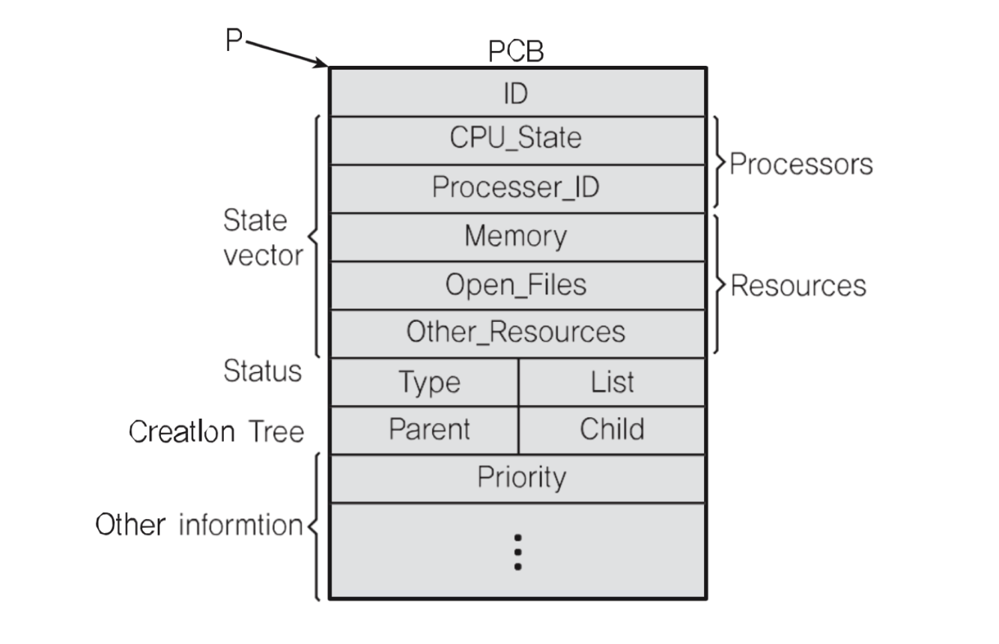

# 🔑 Process Structure

<br>

● プロセス（process）は一般的にどのような構成になっているのでしょうか？
```
○ TEXT: コード
  - program code
  - fixed size
○ DATA: 変数 / 初期化されたデータ
  - initialized global and static variables
  - fixed size
○ BSS: 変数 / 初期化されていないデータ
  - uninitialized global and static variables
  - fixed size
○ HEAP: コードから動的に作られるデータ
  - dynamic variables, managed by malloc(), free(), etc
  - fixed size
○ STACK: 臨時データ(関数呼び出し、ローカル変数等)
  - stack frames consisting of parameters, return addresses and local variables
  - variable size
```
● PC(Program Counter) + SP(Stack Pointer)<br>

<br>

## 📌 Heap
```
#include <stdio.h>
#include <stdlib.h>

int main()
{
    int *data;
    data = (int *) malloc(sizeof(int));
    *data = 1;
    return 0;
}
```

<br>

## 📌 PCB
> PC·SPはどこに保存しますか？

● PCBに保存してProcess Context Blockとも呼ばれ、プロセスが実行中の状態をキャプチャ / 構造化して保存します。
```
○ Process ID
○ Register Value(PC, SP, Etc)
○ Scheduling Info(Process State)
○ Memory Info (Memory Size Limit)
```

<br>

## 📌 PCB: EX) Linux



<br>

### 📌 まとめ

● プロセス構造
```
○ STACK
○ HEAP
○ DATA(BSS, DATA)
○ TEXT(CODE)
```
● PCB
```
○ プロセスの状態情報
- PC
- SP
- Memory
- Scheduling Info
```

<br>
<br>

---

📚 参考講義：[コンピューター工学専攻必須オールインワンパッケージOnline](https://fastcampus.co.kr/dev_online_cs)