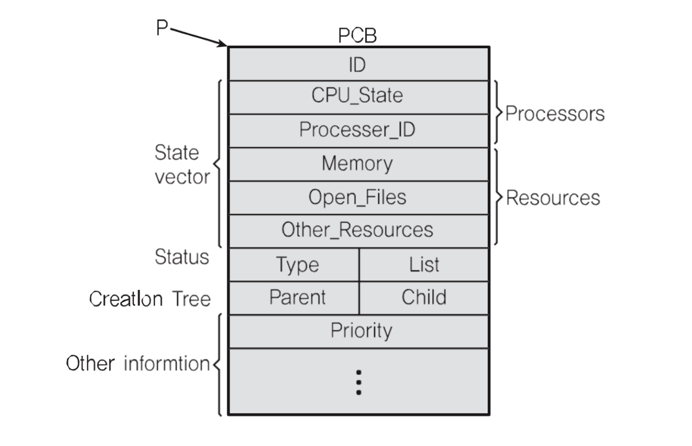

# 🔑 Process Structure

<br>

## 📌 Process Structure

● 프로세스 (process) 는 일반적으로 어떻게 구성되어 있을까?
```
○ TEXT: 코드
  - program code
  - fixed size
○ DATA: 변수 / 초기화된 데이터
  - initialized global and static variables
  - fixed size
○ BSS: 변수 / 초기화 되지 않은 데이터
  - uninitialized global and static variables
  - fixed size
○ HEAP: 코드에서 동적으로 만들어지는 데이터
  - dynamic variables, managed by malloc(), free(), etc
  - fixed size
○ STACK: 임시 데이터 (함수 호출, 로컬 변수 등)
  - stack frames consisting of parameters, return addresses and local variables
  - variable size
```
● PC(Program Counter) + SP(Stack Pointer)<br>

<br>

## 📌 Heap
```
#include <stdio.h>
#include <stdlib.h>

int main()
{
    int *data;
    data = (int *) malloc(sizeof(int));
    *data = 1;

    return 0;
}
```

<br>

## 📌 PCB
> PC, SP는 어디에 저장하나?

● PCB에 저장하며 Process Context Block 이라고도 하며 프로세스가 실행중인 상태를 캡쳐/구조화해서 저장
```
○ Process ID
○ Register Value(PC, SP, Etc)
○ Scheduling Info(Process State)
○ Memory Info (Memory Size Limit)
```

<br>

## 📌 PCB: EX) Linux



<br>

## 📌 정리

● 프로세스 구조
```
○ STACK
○ HEAP
○ DATA(BSS, DATA)
○ TEXT(CODE)
```
● PCB
```
○ 프로세스 상태 정보
  - PC
  - SP
  - Memory
  - Scheduling Info
```


<br>
<br>

---

##### 📚 참고강의：[컴퓨터 공학 전공 필수 올인원 패키지 Online](https://fastcampus.co.kr/dev_online_cs)