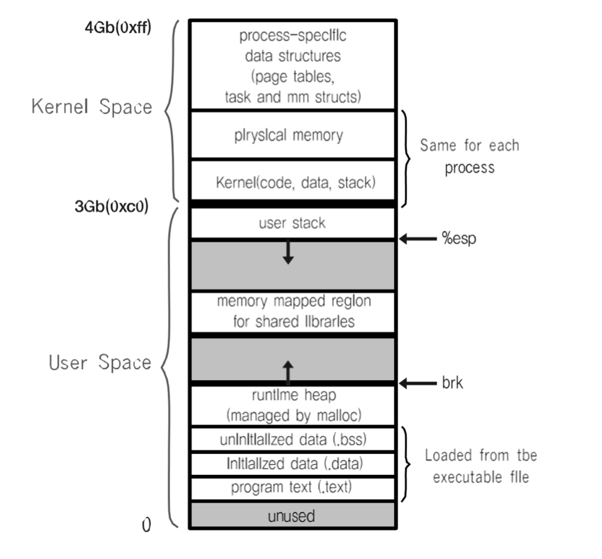
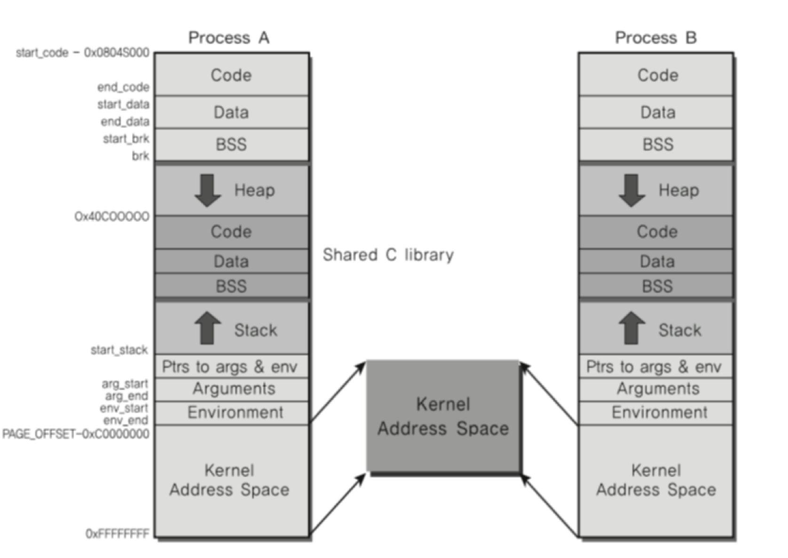

# 🔑 Process And IPC

<br>

## 📌 Process Communication

プロセスがお互いの空間を簡単に接近できるとしたらどうですか。 --プロセスデータ / コードが変わることがありますが、どれぐらい危険でしょうか。

● プロセスは他のプロセスの空間をアクセスできません。<br>

<br>

## 📌 IPC ( InterProcess Communication )

プロセス間でコミュニケーションをとるにはどうすればいいでしょうか。

● プロセス間の通信方法を提供する<br>
● IPC : InterProcess Communication <br>

<br>

## 📌 プロセス間通信が必要ですか？

● 性能を高めるために複数のプロセスを作って同時実行<br>
● このときプロセス間の状態確認およびデータの送受信が必要です<br>

<br>

## 📌 軽く考えて見ましょう

● プロセスをfork()して、複数のプロセスを同時に実行させることができます。
```
○ CPUが一つのときだけ考えますが、最近はCPUの中にコアが8個になることも多く、各プロセスを各コアに同時実行可能（並列処理）。
○ 1 ~ 10000までたす
  - fork()関数で10個のプロセスを作り、それぞれ足し算をさせ、それぞれ足した値を合わせるとより速く動作(この時プロセスの加えた値を収集しなければならないのでプロセス間の通信が必要)。
```
● ウェブサーバーの例
```
○ Webサーバとは？ 要請がありましたら、HTMLファイルをクライアントに提供するプログラム
○ 新しいユーザが来るたびに、fork()関数で新しいプロセスを作り、各ユーザの要請に直ちに対応(この時、プロセス制御および状態情報交換のためプロセス間の通信が必要)。
```

<br>

## 📌 ファイルを使いましたコミュニケーション

プロセス間でコミュニケーションをとるにはどうすればいいでしょうか。

● プロセス間の通信方法を提供する<br>
● IPC : InterProcess Communication
```
○ その中の一つの方法:ファイルを使用します。
  - 簡単に他のプロセスに伝える内容をファイルに書き、他のプロセスが該当ファイルを読めばいいです。
```
● ファイルを使用すると、リアルタイムで直接希望するプロセスにデータの伝達が困難です。
```
○ なぜですか？当該プロセスがファイルを読まなければならないのに… リアルタイムに読んでいるわけにはいかず、より多様なIPC 技法が作られます。
```

<br>

## 📌 Linux Example

● プロセス間の空間は完全に分離されています。
```
○ ユーザーモードではカーネルスペースへのアクセスはできません。
```


● カーネル空間は共有する。<br>


<br>

## 📌 多様なIPC技法

● file<br>
● Message Queue<br>
● Shared Memory<br>
● Shared Memory<br>
● Pipe<br>
● Signal<br>
● Semaphore<br>
● Socket<br>
● ...

<br>

### 📌 まとめ

● 複数のプロセスの同時実行による性能改善、複雑なプログラムのためにプロセス間の通信が必要<br>
● プロセス間の空間が完全分離<br>
● プロセス間通信のための特別な技法が必要となります。
```
○ IPC ( InterProcess Communication )
```
● ほとんどのIPC技法は結局、カーネル空間を活用するのです。
```
○ 理由:カーネル空間は共有していますので
```

<br>
<br>

---

📚 参考講義：[コンピューター工学専攻必須オールインワンパッケージOnline](https://fastcampus.co.kr/dev_online_cs)