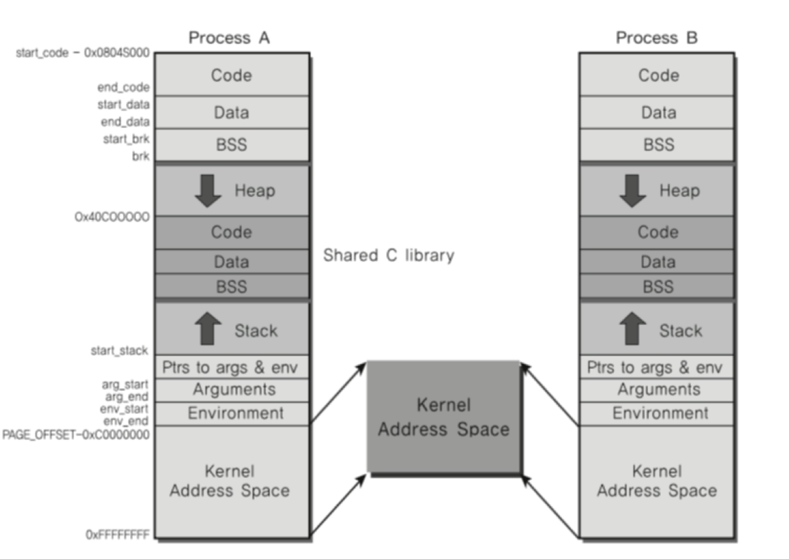

# 🔑 Process And IPC

<br>

## 📌 Process Communication

> 프로세스들이 서로의 공간을 쉽게 접근할 수 있다면? -- 프로세스 데이터 / 코드가 바뀔 수 있으니 얼마나 위험할까?

● 프로세스는 다른 프로세스의 공간을 접근 할 수 없다.<br>

<br>

## 📌 IPC (InterProcess Communication)

> 프로세스간에 커뮤니케이션을 해야한다면 어떻게 해야할까?

● 프로세스간 통신 방법을 제공함<br>
● IPC: InterProcess Communication<br>

<br>

## 📌 프로세스간 통신이 필요한가?

● 성능을 높이기 위해 여러 프로세스를 만들어서 동시 실행<br>
● 이 때 프로세스간 상태 확인 및 데이터 송수신이 필요<br>

<br>

## 📌 가볍게 생각해보기

● 프로세스를 fork() 해서, 여러 프로세스를 동시에 실행시킬 수 있음
```
○ CPU가 한 개일때만 생각하지만, 최근에는 CPU안에 코어가 8개 되는 경우도 많고, 각 프로세스를 각 코어에 동시 실행 가능(병렬 처리)
○ 1 ~ 10000까지 더하기
  - fork() 함수로 10개 프로세스 만들어서 각각 더하기를 시키고, 각각 더한값을 합하면 더 빠르게 동작(이때 프로세스가 더한 값을 수집해야하므로 프로세스간 통신 필요)
```
● 웹서버의 예
```
○ 웹서버란? 요청이 오면, HTML 파일을 클라이언트에 제공하는 프로그램
○ 새로운 사용자가 올 때마다, fork() 함수로 새로운 프로세스 만들고, 각 사용자 요청에 즉시 대응(이때 프로세스 제어 및 상태 정보 교환을 위해 프로세스간 통신 필요)
```

<br>

## 📌 파일을 사용한 커뮤니케이션

> 프로세스간에 커뮤니케이션을 해야한다면 어떻게 해야할까?

● 프로세스간 통신 방법을 제공함<br>
● IPC: InterProcess Communication
```
○ 그 중의 한가지 방법: file 사용
  - 간단히 다른 프로세스에 전달할 내용을 파일에 쓰고, 다른 프로세스가 해당 파일을 읽으면 됨
```
● file을 사용하면, 실시간으로 직접원하는 프로세스에 데이터 전달이 어려움
```
○ 왜? 해당 프로세스가 파일을 읽어야 하는데... 계속 실시간으로 읽고만 있을 수는 없으니, 보다 다양한 IPC 기법이 만들어진다.
```

<br>

## 📌 Linux Example

● 프로세스간 공간은 완전히 분리되어 있다.
```
○ 사용자 모드에서는 커널 공간 접근 불가
```


● 커널 공간은 공유한다.<br><br>


<br>

## 📌 다양한 IPC 기법

● file<br>
● Message Queue<br>
● Shared Memory<br>
● Shared Memory<br>
● Pipe<br>
● Signal<br>
● Semaphore<br>
● Socket<br>
● ...

<br>

## 📌 정리

● 여러 프로세스 동시 실행을 통한 성능 개선, 복잡한 프로그램을 위해 프로세스간 통신 필요<br>
● 프로세스간 공간이 완전 분리<br>
● 프로세스간 통신을 위한 특별한 기법 필요
```
○ IPC (InterProcess Communication)
```
● 대부분의 IPC 기법은 결국 커널 공간을 활용하는 것임
```
○ 이유: 커널 공간은 공유하기 때문
```

<br>
<br>

---

##### 📚 참고강의：[컴퓨터 공학 전공 필수 올인원 패키지 Online](https://fastcampus.co.kr/dev_online_cs)