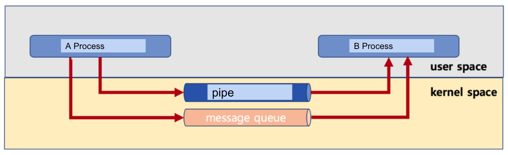
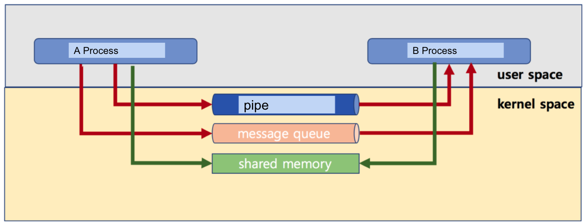

# 🔑 IPC Technique

<br>

## 📌 pipe

● 기본 파이프는 단반향 통신<br>
● fork()로 자식 프로세스 만들었을 때, 부모와 자식간의 통신
```
char* msg = "Hello Child Process!";
int main()
{
    char buf[255];
    int fd[2], pid, nbytes;
    if (pipe(fd) < 0)
        exit(1);
    pid = fork();
    if (pid >0) {
        write(fd[1], msg, MSGSIZE);
        exit(0);
    }
    else {
        nbytes = read(fd[0], buf, MSGSIZE);
        print("%d %s\n", nbytes, buf);
        exit(0);
    }
    return 0;
}
```

<br>

## 📌 message queue

● 기본은 FIFO 정책으로 데이터 전송<br>
● A process
```
msqid = msgget(key, msgflg)
msgsnd(msqid, &sbuf, buf_length, IPC_NOWAIT)
```
● B process
```
msqid = msgget(key, msgflg)
msgrcv(msqid, &rbuf, MSGSZ, 1, 0)
```

<br>

## 📌 pipe and message queue

● message queue는 부모 / 자식이 아니라, 어느 프로세스 간에라도 데이터 송수신이 가능<br>
● 먼저 넣은 데이터가, 먼저 읽혀진다.<br>

<br>

## 📌 pipe vs message queue

● 부모 / 자식 프로세스간 only or not<br>
● 단방향만 가능 or 양방향 가능<br>

<br>

## 📌 IPC 기법과 커널 모드

● pipe, message queue 는 모두 kernel 공간의 메모리를 사용합니다.<br>



<br>

## 📌 shared memory

● 노골적으로 kernel space에 메모리 공간을 만들고, 해당 공간을 변수처럼 쓰는 방식<br>
● message queue 처럼 FIFO 방식이 아니라, 해당 메모리 주소를 마치 변수처럼 접근하는 방식<br>
● 공유메모리 key를 가지고, 여러 프로세스가 접근 가능<br>



<br>

## 📌 Shared Memory Code Example

● 1. 공유 메모리 생성 및 공유 메모리 주소 얻기
```
shmid = shmget((key_t)1234, SIZE, IPC_CREAT|0666))
shmaddr = shmat(shmid, (void *)0, 0)
```
● 2. 공유 메모리에 쓰기
```
strcpy((char *) shmaddr, "Linux Programming")
```
● 3. 공유 메모리에서 읽기
```
printf("%s\n", (char *)shmaddr)
```

<br>

## 📌 정리

● 주요 IPC 기법
```
○ pipe
○ message queue
○ shared memory
```
● 모두 커널 공간을 활용해서 프로세스간 데이터 공유<br>

<br>
<br>

---

##### 📚 참고강의：[컴퓨터 공학 전공 필수 올인원 패키지 Online](https://fastcampus.co.kr/dev_online_cs)