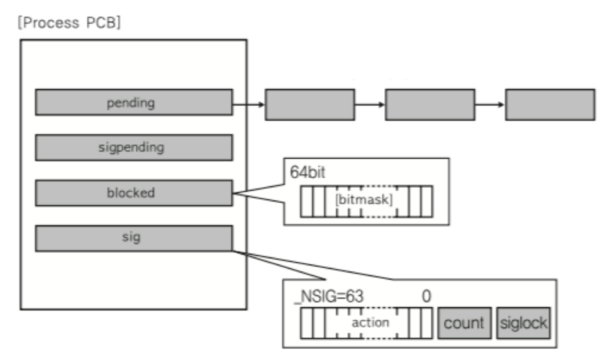
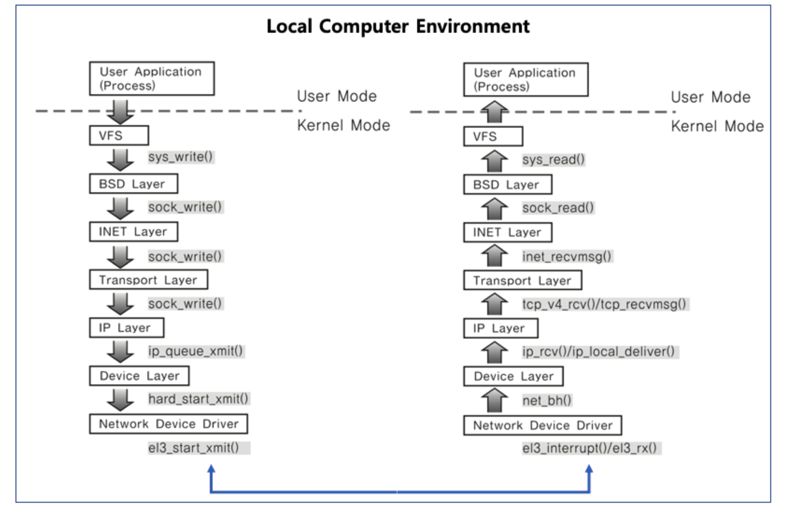

# 🔑 Signal And Socket

<br>

## 📌 プロセス間のコミュニケーション

> IPC技法ですが、これ以外にもよく使われる二つの技術

● たくさん使っている二つ
```
○ signal
○ socket
```

<br>

## 📌 Signal

● ユニックスで30年以上使用された伝統的な技法<br>
● カーネルまたはプロセスで他のプロセスにどのようなイベントが発生したのかを知らせる技法<br>
● プロセス関連コードに関連シグナルハンドラを登録し、該当シグナル処理を行います。
```
1. 「シグナル無視」
2. シグナルブロック（ブロックを解く瞬間、プロセスに該当シグナル伝達）
3. 登録されたシグナルハンドラで特定動作を行います。
4. 登録されたシグナルハンドラがなければ、カーネルで基本動作を遂行します。
```

<br>

## 📌 主要シグナル

● SIGKILL:スーパー管理者が使用するシグナルで、プロセスはどんな場合でもkill<br>
● SIGALARM:アラームを発生<br>
● SIGSTP:プロセスを停止<br>
● SIGCONT:停止したプロセスを実行<br>
● SIGINT:プロセスに割り込みを送ってプロセスkill<br>
● SIGSEGV:プロセスが異なるメモリ領域を侵犯<br>

<br>

## 📌 About Signal Example

● シグナルハンドラ登録及びハンドラを実装
```
static void signal_handler (int signo) {
    printf("Catch SIGINT!\n");
    exit(EXIT_SUCCESS);
}

int main(void) {
    if (siganl(SIGINT, signal_hanlder) == SIG_ERR) {
        printf("Can't catch SIGINT!\n");
        exit(EXIT_FAILURE);
    }

    for(;;)
        pause();

    return 0;
}
```
● シグナルハンドラを無視
```
int main(void) {
    if (siganl(SIGINT, SIG_IGN) == SIG_ERR) {
        printf("Can't catch SIGINT!\n");
        exit(EXIT_FAILURE);
    }

    for(;;)
        pause();

    return 0;
}
```

<br>

## 📌 Signal And Process

● PCBに該当プロセスがブロックまたは処理しなければならないシグナル関連情報を管理します。



<br>

## 📌 Socket

● ソケットはネットワーク通信のための技術<br>
● 基本的にはクライアントとサーバの2つの異なるコンピュータ間のネットワーク基盤通信のための技術<br>

<br>

## 📌 Socket And IPC

● ソケットを一つのコンピューターの中で、二つのプロセス間で通信技法として使用できます。



<br>

## 📌 まとめ

● さまざまなIPC 技法を活用して、プロセス間通信が可能です。<br>
● IPC技法以外でも使用できる、2つの技術
```
○ siganl
○ socket
```

<br>
<br>

---

📚 参考講義：[コンピューター工学専攻必須オールインワンパッケージOnline](https://fastcampus.co.kr/dev_online_cs)