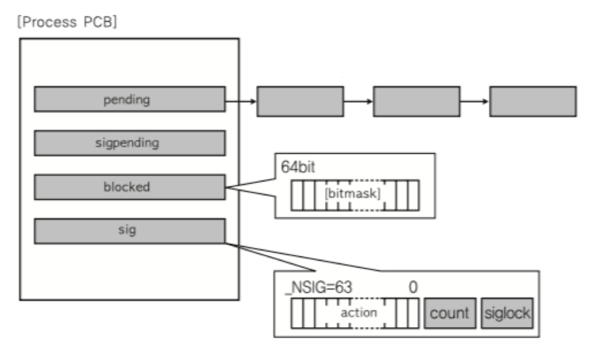

# 🔑 Signal And Socket

<br>

## 📌 프로세스간 커뮤니케이션

> IPC 기법이지만만, 이외에도 많이 사용되는 두 가지 기술

● 많이 사용하는 두가지
```
○ siganl
○ socket
```

<br>

## 📌 Signal

● 유닉스에서 30년 이상 사용된 전통적인 기법<br>
● 커널 또는 프로세스에서 다른 프로세스에 어떤 이벤트가 발생되었는지를 알려주는 기법<br>
● 프로세스 관련 코드에 관련 시그널 핸들러를 등록해서, 해당 시그널 처리 실행
```
1. 시그널 무시
2. 시그널 블록(블록을 푸는 순간, 프로세스에 해당 시그널 전달)
3. 등록된 시그널 핸들러로 특정 동작 수행
4. 등록된 시그널 핸들러가 없다면, 커널에서 기본 동작 수행
```

<br>

## 📌 주요 시그널

● SIGKILL: 슈퍼관리자가 사용하는 시그널로, 프로세스는 어떤 경우든 kill<br>
● SIGALARM: 알람을 발생<br>
● SIGSTP: 프로세스를 정지<br>
● SIGCONT: 정지된 프로세스를 실행<br>
● SIGINT: 프로세스에 인터럽트를 보내서 프로세스 kill<br>
● SIGSEGV: 프로세스가 다른 메모리영역을 침범<br>

<br>

## 📌 About Signal Example

● 시그널 핸들러 등록 및 핸들러 구현
```
static void signal_handler (int signo) {
    printf("Catch SIGINT!\n");
    exit(EXIT_SUCCESS);
}

int main(void) {
    if (siganl(SIGINT, signal_hanlder) == SIG_ERR) {
        printf("Can't catch SIGINT!\n");
        exit(EXIT_FAILURE);
    }

    for(;;)
        pause();

    return 0;
}
```
● 시그널 핸들러 무시
```
int main(void) {
    if (siganl(SIGINT, SIG_IGN) == SIG_ERR) {
        printf("Can't catch SIGINT!\n");
        exit(EXIT_FAILURE);
    }

    for(;;)
        pause();

    return 0;
}
```

<br>

## 📌 Signal And Process

● PCB에 해당 프로세스가 블록 또는 처리해야하는 시그널 관련 정보 관리



<br>

## 📌 Socket

● 소켓은 네트워크 통신을 위한 기술<br>
● 기본적으로는 클라이언트와 서버등 두 개의 다른 컴퓨터간의 네트워크 기반 통신을 위한 기술<br>

<br>

## 📌 Socket And IPC

● 소켓을 하나의 컴퓨터 안에서, 두 개의 프로세스간에 통신 기법으로 사용 가능


<br>

## 📌 정리

● 다양한 IPC 기법을 활용해서, 프로세스간 통신이 가능하다.<br>
● IPC 기법 이외에도 사용할 수 있는 다음 두 가지 기술 개념을 알아둡니다.
```
○ siganl
○ socket
```

<br>
<br>

---

##### 📚 참고강의：[컴퓨터 공학 전공 필수 올인원 패키지 Online](https://fastcampus.co.kr/dev_online_cs)