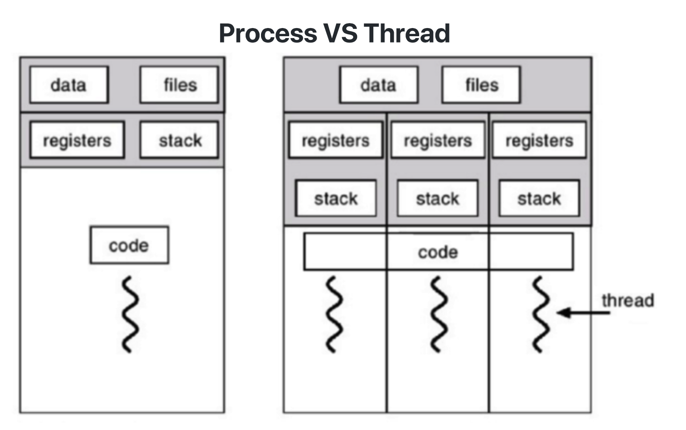
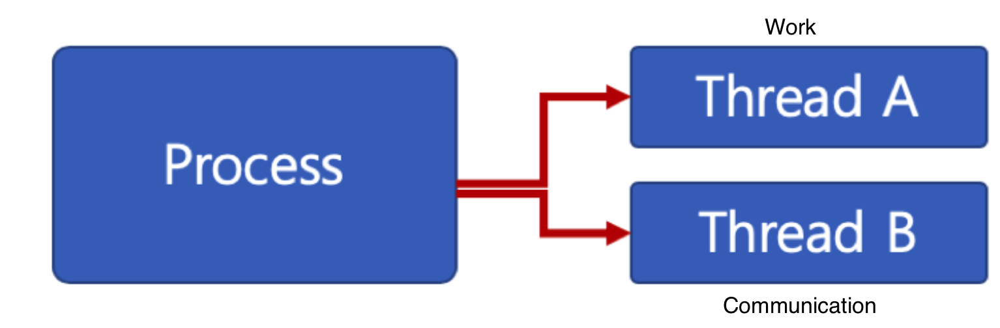
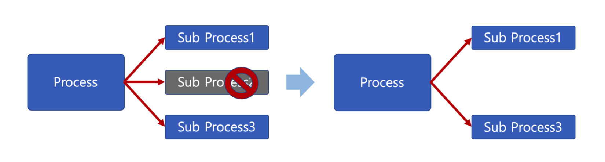

# 🔑 Thread

<br>

## 📌 Thread

● Light Weight Processという <br>
● process
```
○ プロセス間では各プロセスへのデータアクセスができません
```
● thread
```
○ 1つのプロセスで複数のスレッドを作成できます。
○ スレッドは同時実行可能となります。
○ プロセスの中にあるので、プロセスのデータを全てアクセス可能
```
● threadはそれぞれ実行が可能なstackが存在します。



<br>

## 📌 Multi Thread

● ソフトウェアの並行作業処理のためにMulti Threadを使用します。
● Thread別コード、data、heap領域は親プロセスのcode、data、heap領域を通じて共有します。

<br>

## 📌 Thread 長所 ①

● ユーザーに対する応答性の向上<br>



<br>

## 📌 Thread 長所 ②

● 資源共有効率が高いです
```
○ IPC技法のようにプロセス間の資源共有のため、煩わしい作業が要らないです。
○ プロセスの中にあるので、プロセスのデータを全てアクセス可能
```

<br>

## 📌 Thread 長所 ③

● 作業が切り離されてコードが簡潔です
```
○ 実は作成次第です。
```

<br>

## 📌 Thread 短所

● スレッドのうち1スレッドのみ問題があっても、全プロセスが影響を受ける<br>
● Multi Process <br>



● Multi Thread <br>


● スレッドを多く生成すると、Context Switchingが多く起こり、性能低下<br>
● Example: LinuxではThreadをProcessのように扱います。
```
○ スレッドを多く生成すると、すべてのスレッドをスケジューリングしなければならないので、Context Switching が頻繁になるしかありません。
```

<br>

## 📌 Thread vs Process

● プロセは独立的、スレッドはプロセスのサブセット<br>
● プロセスはそれぞれ独立的な資源を持ち、スレッドはプロセス資源共有<br>
● プロセスは自分だけのアドレス領域を持つ、スレッドはアドレス領域共有<br>
● プロセス間はIPC技法で通信しなければならない、スレッドは不要<br>

<br>

## 📌 まとめ
 
● Thread概念整理
```
○ プロセスと違い、スレッド間の資源共有です。
```
● Thread 長所
```
○ CPU活用度を高い
○ 性能改善可能
○ 応答性を向上させます。
○ 資源共有が効率的(IPCを使わなくてもいいです)
```
● Thread 短所
```
○ 1つのスレッド問題が、プロセス全般に影響を及ぼします。
○ 複数のスレッドを作成すると性能が低下します。
```

<br>
<br>

---

📚 参考講義：[コンピューター工学専攻必須オールインワンパッケージOnline](https://fastcampus.co.kr/dev_online_cs)