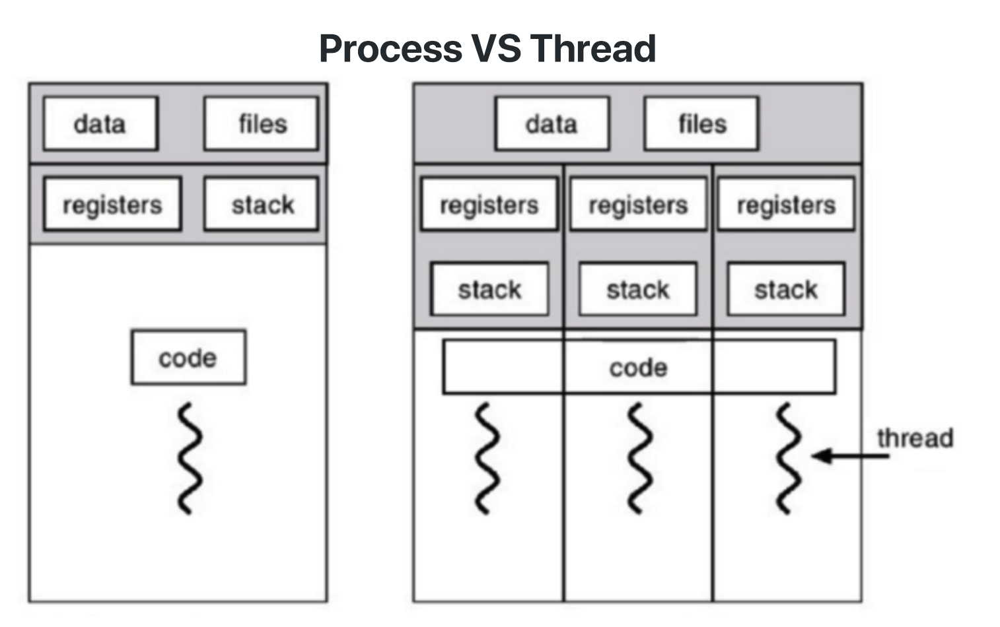
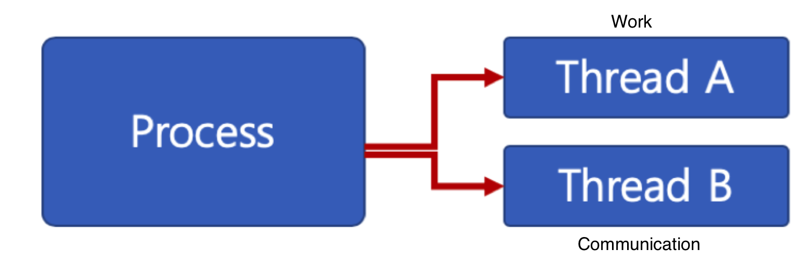
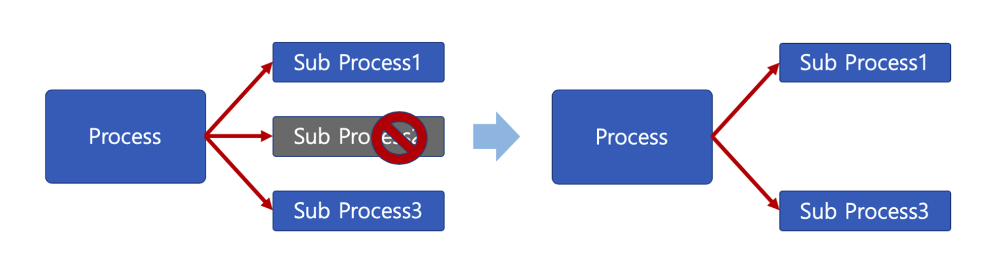

# 🔑 Thread

<br>

## 📌 Thread

● Light Weight Process 라고도 함<br>
● process
```
○ 프로세스 간에는 각 프로세스의 데이터 접근이 불가
```
● thread
```
○ 하나의 프로세스에 여래개의 스레드 생성 가능
○ 스레드들을은 동시에 실행 가능
○ 프로세스 안에 있으므로, 프로세스의 데이터를 모두 접근 가능
```
● thread는 각기 실행이 가능한 stack 존재



<br>

## 📌 Multi Thread

● 소프트웨어 병행 작업 처리를 위해 Multi Thread를 사용함<br>
● Thread별 code, data, heap 영역은 부모 프로세스의 code, data, heap 영역을 통해 공유

<br>

## 📌 Thread 장점 ①

● 사용자에 대한 응답성 향상<br>



<br>

## 📌 Thread 장점 ②

● 자원 공유 효율
```
○ IPC 기법과 같이 프로세스간 자원 공유를 위해 번거로운 작업이 필요 없
○ 프로세스 안에 있으므로, 프로세스의 데이터를 모두 접근 가능
```

<br>

## 📌 Thread 장점 ③

● 작업이 분리되어 코드가 간결
```
○ 사실 작성하기 나름
```

<br>

## 📌 Thread 단점

● 스레드 중 한 스레드만 문제가 있어도, 전체 프로세스가 영향을 받음<br>
● Multi Process<br>



● Multi Thread<br>


● 스레드를 많이 생성하면, Context Switching이 많이 일어나, 성능 저하<br>
● Example: Linux 에서는 Thread를 Process와 같이 다룸
```
○ 스레드를 많이 생성하면, 모든 스레드를 스케쥴링 해야하므로, Context Switching이 빈번할 수 밖에 없다.
```

## 📌 Thread vs Process

● 프로세는 독립적, 스레드는 프로세스의 서브셋<br>
● 프로세스는 각각 독립적인 자원을 가짐, 스레드는 프로세스 자원 공유<br>
● 프로세스는 자신만의 주소영역을 가짐, 스레드는 주소영역 공유<br>
● 프로세스간에는 IPC 기법으로 통신해야 함, 스레드는 필요 없음<br>

<br>

## 📌 정리

● Thread 개념 정리
```
○ 프로세스와 달리 스레드간 자원 공유
```
● Thread 장점
```
○ CPU 활용도를 높임
○ 성능 개선 가능
○ 응답성 향상
○ 자원 공유 효율　(IPC를 안써도 됨)
```
● Thread 단점
```
○ 하나의 스레드 문제가, 프로세스 전반에 영향을 미침
○ 여러 스레드 생성시 성능 저하 가능
```

<br>
<br>

---

##### 📚 참고강의：[컴퓨터 공학 전공 필수 올인원 패키지 Online](https://fastcampus.co.kr/dev_online_cs)