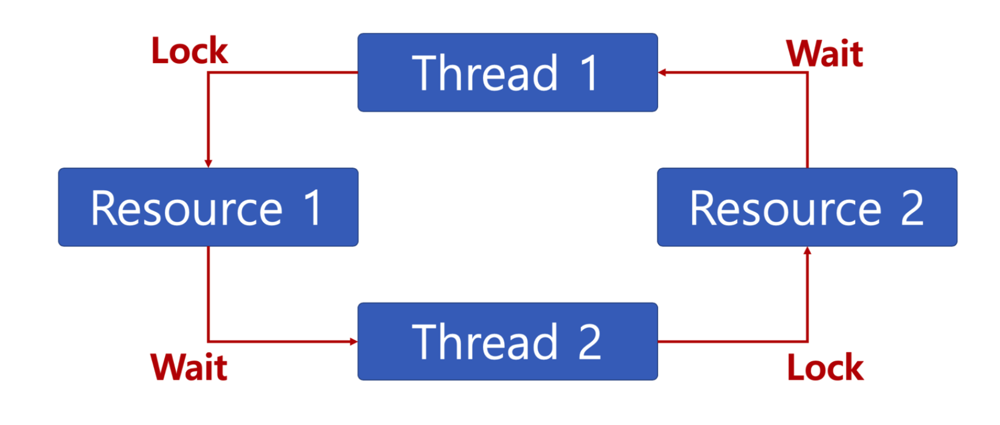

# 🔑 Deadlock And Starvation

<br>

## 📌 Deadlock

● 二つ以上の作業がお互いに相手の作業が終わるのを待っていますので、次の段階に進めない状態
```
○ 無限待機状態。
○ バッチ処理システムでは発生しませんが、プロセス、スレッドでは発生することがあります。
```



<br>

## 📌 Cause of Deadlock

> 次の4つの条件がすべて成立すると、交渉状態が発生する可能性があります。

● Mutual exclusion: プロセスが必要とする資源に対して排他的な統制権を要求します。<br>
● Hold and wait: プロセスが割り当てられた資源を持った状態で他の資源を待つ。<br>
● No preemption: プロセスがある資源の使用を終えるまで、その資源を奪うことはできません。<br>
● Circular wait: 各プロセスは循環的に次のプロセスが求める資源を持っています。<br>

<br>

## 📌 Deadlock Solution

● Deadlock Prevention<br>
● Deadlock Avoidance<br>
● Deadlock Detection<br>
● Deadlock Recovery<br>

<br>

## 📌 Deadlock Prevention

> 4つの条件が全て成立した時、deadlock発生可能性がある。

● Mutual exclusion elimination: 臨界領域除去<br>
● Hold and wait elimination: 一度に全ての必要資源占有および解除<br>
● No preemption elimination: 先取り可能技法を作ってくれます<br>
● Circular wait elimination: 資源タイプによって手順をつける<br>

<br>

## 📌 Deadlock Avoidance

> 交渉状態条件1、2、3は置いて、4だけ除去（1、2、3除去時、プロセス実行非効率性が増大）

> 交渉状態条件のうち、資源割当順序を定義しません(Circular wait elimination)

● Mutual exclusion elimination: 臨界領域除去<br>
● Hold and wait elimination: 一度に全ての必要資源占有および解除<br>
● No preemption elimination: 先取り可能技法を作ってくれます<br>
● カリキュラウエイション: 資源タイプによって手順をつける<br>

<br>

## 📌 Deadlock Detection and Deadlock Recovery

● Deadlock Detection
```
○ 交渉状態が発生しているかどうかを点検し、交渉状態にあるプロセスと資源を発見します。
```
● Deadlock Recovery
```
○ 交渉状態を引き起こしたプロセスを終了したり、交渉状態のプロセスに割り当てられた資源を先取りしてプロセスや資源を回復したりすることです。
```

<br>

## 📌 Starvation

● 特定のプロセスの優先順位が低く、希望する資源が割り当てられ続けている状態<br>
● Deadlock And Starvation
```
○ Deadlockは様々なプロセスが同じリソース占有を要請する場合に発生します。
○ Starvationは様々なプロセスが不足した資源を占有するために競争する時、特定のプロセスは永遠に資源割り当てができない場合を主に意味します。
```

<br>

## 📌 Starvation Solution

● 優先順位の変更
```
○ プロセスの優先順位を随時変更し、各プロセスの高い優先順位を持つ機会を与えます。
○ 長く待ったプロセスの優先順位を高めてくれます
○ 優先順位ではなく、リクエスト順に処理するFIFO基盤のリクエストキューを使用します。
```

<br>
<br>

---

📚 参考講義：[コンピューター工学専攻必須オールインワンパッケージOnline](https://fastcampus.co.kr/dev_online_cs)