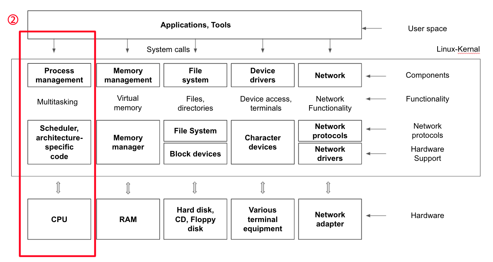

# Scheduling Algorithm

 

 

## [🔗 Thread Basic Concept](4_1_thread_basic_concept)

 

## [🔗 Synchronization Issue And Semaphore](4_2_synchronization_issue_and_semaphore)

 

## [🔗 Deadlock And Starvation](4_3_deadlock_and_starvation)

 