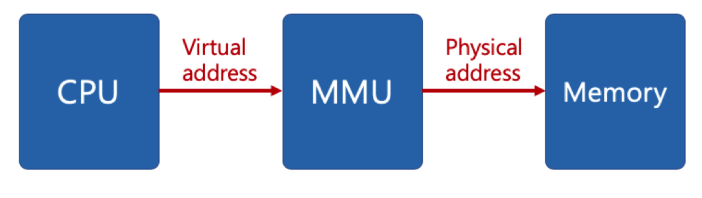

# 🔑 Virtual Memory Basic Concept

<br>

## 📌 Virtual Memory System - 1

> 実際に、各プロセスごとに十分なメモリを割り当てるにはメモリの大きさに限界があります。

> フォンノイマン構造なので、コードはメモリに必ず必要です。

● Ex)リナックスは1つのプロセスが4GB<br>
● Ex)通常メモリは8GB？16GB？
```
○ 無限待機状態
○ バッチ処理システムでは発生しませんが、プロセス、スレッドでは発生することがあります。
```
● 仮想メモリとは:メモリが実際のメモリより多く見えるようにする技術です。
```
○ 実際に使用するメモリは小さいという点に着眼して考案された技術です。
○ プロセス間の空間分離により、プロセスイシューが全体システムに影響を与えないです。
```

<br>

##📌 仮想メモリが必要な理由

● 1つのプロセスのみ実行可能なシステム(Batch System, Etc..)
```
○ 1.プログラムをメモリにロード
○ 2.プロセスを実行
○ 3.プロセス終了（メモリ解除）
```
● 複数のプロセスを同時に実行するシステム
```
○ 1.メモリー容量の不足issue
○ 2.プロセス·メモリ領域間で侵犯issue
```

<br>

## 📌 Virtual Memory System - 2

● 仮想メモリーの基本アイデア
```
○ プロセスは仮想アドレスを使用して、実際の該当アドレスでデータを読み/書く時だけ物理アドレスに変えてくれればいいです。
○ virtual address : プロセスが参照するアドレス
○ physical address:実際のメモリアドレス
```
● MMU ( Memory Management Unit )
```
○ CPUにコードを実行する際、仮想アドレスへのアクセスが必要な場合、該当アドレスを物理アドレス値に変換するハードウェア装置
```

<br>

## 📌 Virtual Memory System - 3

● メインメモリに実際の各プロセスのデータが彫刻で書いています。<br>

<br>

## 📌 Virtual Memory System And MMU

● CPUは仮想メモリを扱っており、実際の該当アドレスにアクセスするとMMUハードウェア装置を通じて物理メモリにアクセスします。
```
○ ハードウェア装置を利用するとアドレス変換が早いので別途装置を置く
```



<br>
<br>

---

📚 参考講義：[コンピューター工学専攻必須オールインワンパッケージOnline](https://fastcampus.co.kr/dev_online_cs)