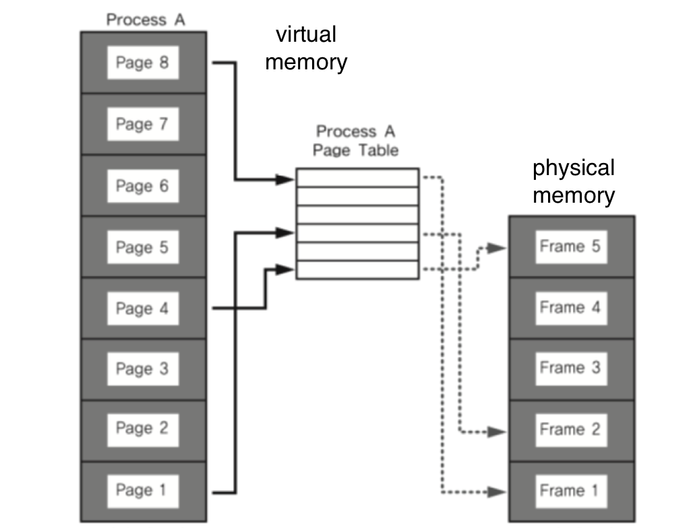

# 🔑 Paging System

<br>

## 📌 paging system - 1

● 同じサイズのページで仮想アドレス空間とこれにマッチングする物理アドレス空間を管理<br>
● ハードウェア支援が必要となります。
```
○ 例）intel x86システム（32bit）では4KB、2MB、1GBに対応しています。
```
● リナックスでは4KBでpaging<br>
● ページ番号をベースに仮想アドレス/物理アドレスマッピング情報を記録/使用<br>

<br>

## 📌 paging system - 2

● プロセス（4GB）のPCBにPageTable構造体を指す手間がかかる<br>
● Page Tableには仮想アドレスと物理アドレス間のマッピング情報があります<br>



<br>

## 📌 paging system structure

● pageまたはpage frame:固定されたサイズのblock(4KB)<br>
● paging system
```
○ 仮想アドレスv=(p,d)
  -p: 仮想メモリーページ
  -d: pの中で参照する位置
```
● ページの大きさが 4KB 例
```
○ 仮想アドレスの0ビットから11ビットが変位を示します。
○ 12ビット以上がページ番号になることがあります
```

> プロセスが4GBを使う理由-32bitシステムで2の32移乗4GBです。

<br>

## 📌 paging table

● 物理アドレスにあるページ番号と該当するページの最初の物理アドレス情報をマッピングした表<br>
● 仮想アドレスv=(p,d)でしたら
```
○ p: ページ番号です
○ d: ページの始めからどれぐらい離れた位置七日
```

<br>

## 📌 paging system 動作

● 当該プロセスで特定の仮想アドレスにアクセスするためには、利用できません。
```
○ 当該プロセスのpagingtableに当該仮想アドレスが含まれたページ番号があるかを確認します。
○ page番号があれば、このpageがマッピングされた最初の物理アドレスを調べます。
○ p'+dが実際の物理アドレスになります
```

<br>

## 📌 paging system and mmu

● CPUは仮想アドレスにアクセスする際
```
○ MMUハードウェア装置を通して物理メモリにアクセスします。
```
● プロセス作成時、ページテーブル情報を生成します。
```
○ PCBなどで該当ページへアクセスでき、関連情報は物理メモリに積載します。
○ プロセス駆動時、該当ページのテーブルベースアドレスが別途レジスタに保存(CR3)
○ CPUが仮想アドレスにアクセスする際、MMUがページテーブルbaseアドレスをアクセスし、物理アドレスを取得します。
```

<br>
<br>

---

📚 参考講義：[コンピューター工学専攻必須オールインワンパッケージOnline](https://fastcampus.co.kr/dev_online_cs)