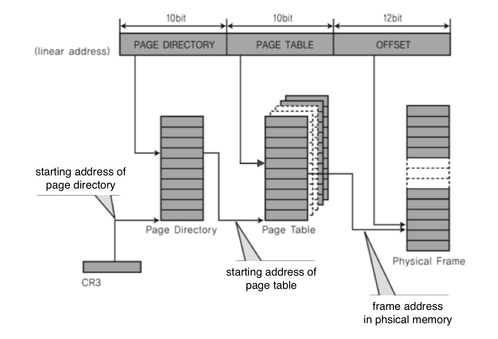
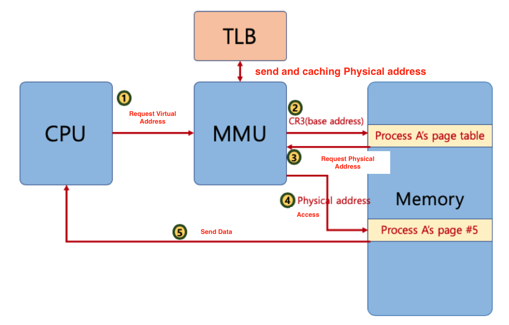

# 🔑 Paging System Strength

<br>

## 📌 what is multi - level paging system ?

● 32bitシステムで4KBページのためのページングシステムとは？
```
○ 下位12bitはオフセットです。
○ 上位20bitがページング番号なので、2の20乗(1048576)個のページ情報が必要
```
● ページング情報をステップを分けて作成します。
```
○ 不要なページは生成しなければ、省スペースが可能です
```
● ページ番号を示すbitを使い分け（リナツクスは3段階、直近4段階）<br>



<br>

## 📌 MMU And TLB

● MMUが物理アドレスを確認するためにメモリを行かなければなりません<br>


● MMUはページ情報キャッシュ<br>



<br>

## 📌 Memory Layer


<br>

## 📌 Paging System And Shared Memory

● プロセス間で同一の物理アドレスを指せます（省スペース、メモリ割り当ての時間節約）<br>
● 物理アドレスデータ変更時
```
○ 物理アドレスにデータを修正する際、物理アドレスをコピーできます(copy-on-write)
```


<br>

## 📌 Demand Paging

● プロセスすべてのデータをメモリに積載せず、実行中必要な時点でのみメモリに積載します。
```
○ prepagingの反対概念:あらかじめプロセス関連の全てのデータをメモリに載せてから実行する概念
○ これ以上必要でないページフレームは再び保存媒体に保存(ページ交換アルゴリズムが必要)
```

<br>
<br>

---

📚 参考講義：[コンピューター工学専攻必須オールインワンパッケージOnline](https://fastcampus.co.kr/dev_online_cs)