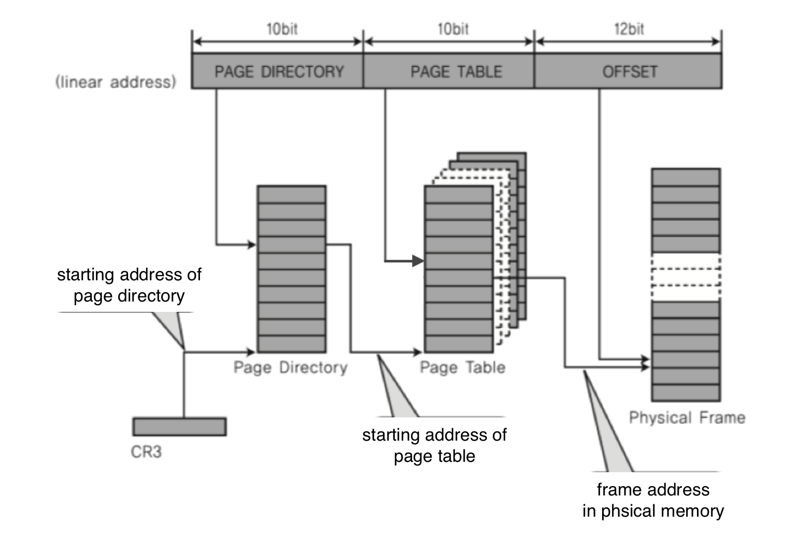
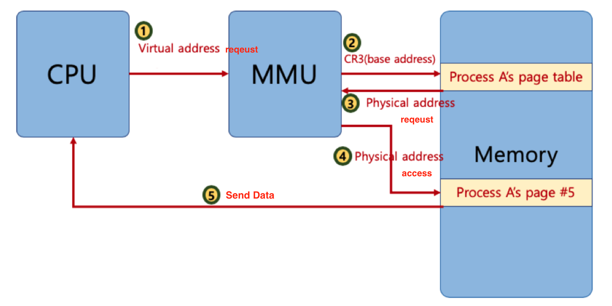
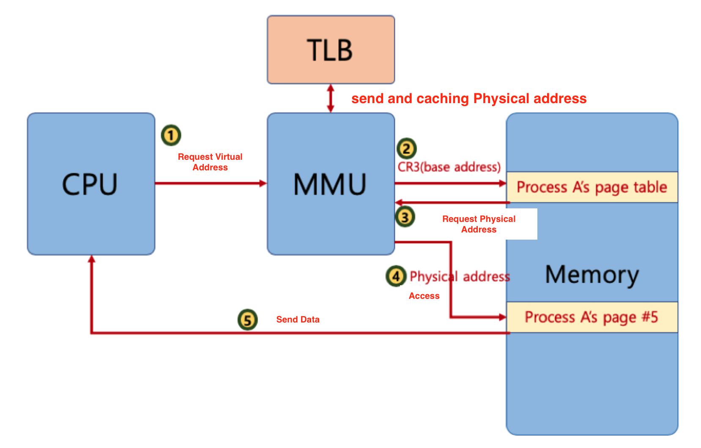
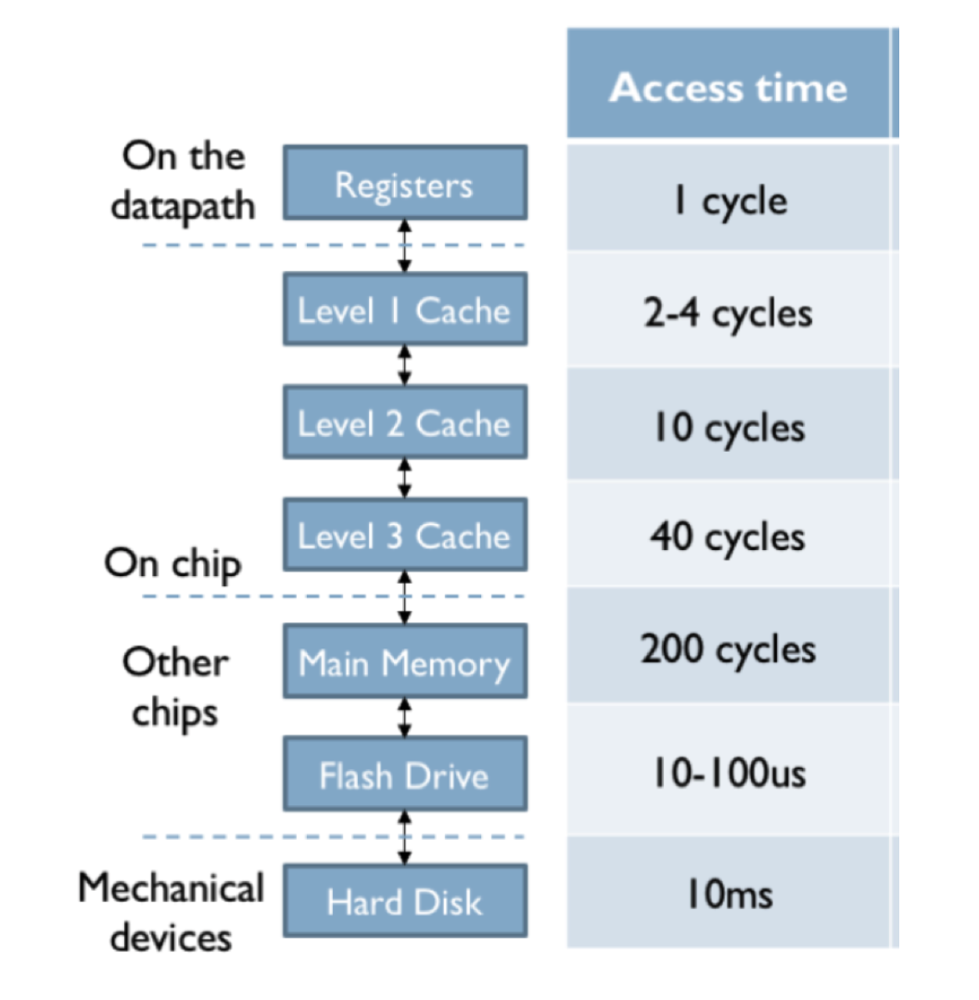
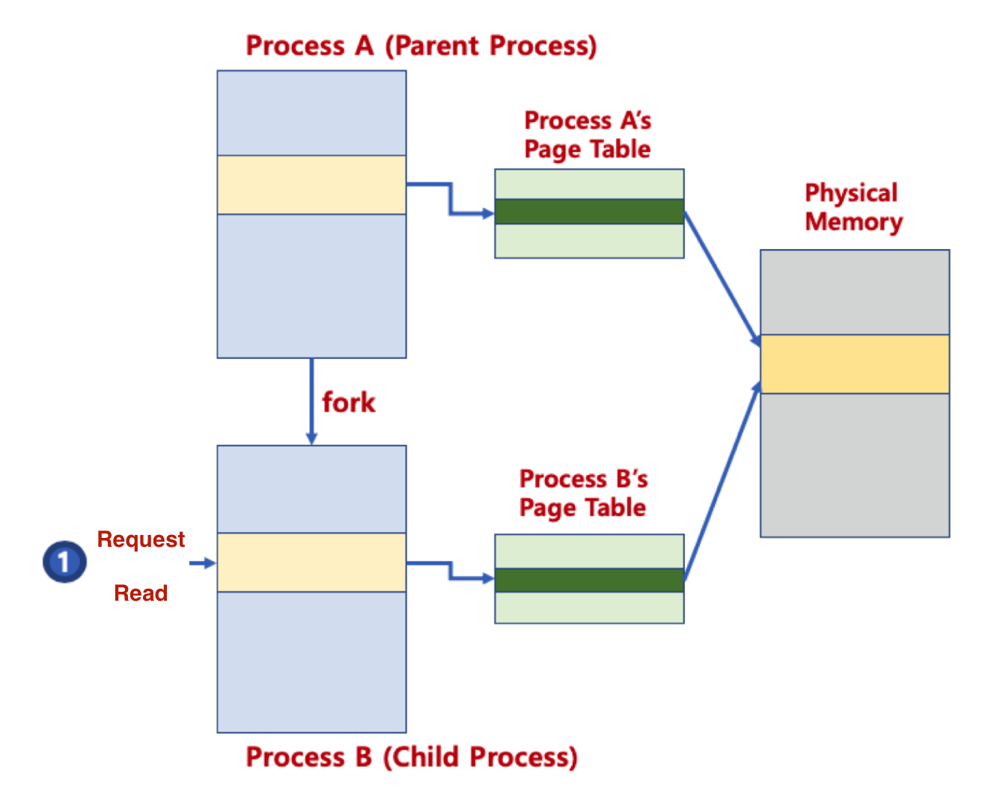

# 🔑 Paging System Strength

<br>

## 📌 what is multi-level paging system?

● 32bit 시스템에서 4KB 페이지를 위한 페이징 시스템이란?
```
○ 하위 12bit는 오프셋
○ 상위 20bit가 페이징 번호이므로, 2의 20승(1048576)개의 페이지 정보가 필요함
```
● 페이징 정보를 단계를 나누어 생성
```
○ 필요없는 페이지는 생성하지 않으면, 공간 절약 가능
```
● 페이지 번호를 나타내는 bit를 구분해서, 단계를 나눔(리눅스는 3단계, 최근 4단계)<br>



<br>

## 📌 MMU And TLB

● MMU가 물리 주소를 확인하기 위해 메모리를 갔다와야 함<br>



● MMU는 페이지 정보 캐쉬<br>



<br>

## 📌 Memory Layer



<br>

## 📌 Paging System And Shared Memory

● 프로세스간 동일한 물리 주소를 가리킬 수 있음(공간 절약, 메모리 할당의 시간 절약)<br>
● 물리 주소 데이터 변경시
```
○ 물리 주소에 데이터 수정 시도시, 물리 주소를 복사할 수 있음(copy-on-write)
```



<br>

## 📌 Demand Paging

● 프로세스 모든 데이터를 메모리로 적재하지 않고, 실행 중 필요한 시점에서만 메모리로 적재함
```
○ prepaging의 반대 개념: 미리 프로세스 관련 모든 데이터를 메모리에 올려놓고 실행하는 개념
○ 더 이상 필요하지 않은 페이지 프레임은 다시 저장매체에 저장(페이지 교체 알고리즘 필요)
```


<br>
<br>

---

##### 📚 참고강의：[컴퓨터 공학 전공 필수 올인원 패키지 Online](https://fastcampus.co.kr/dev_online_cs)