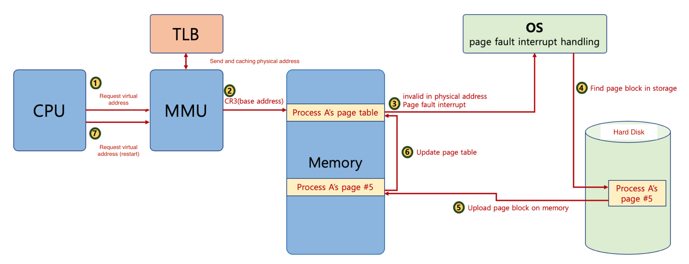

# 🔑 Page Fault

<br>

## 📌 what is page fault?

● 32bit 시스템에서 4KB 페이지를 위한 페이징 시스템이란?<br>
● 운영체제가 page fault가 일어나면, 해당 페이지를 물리 메모리에 올림<br>

<br>

## 📌 page fault and interrupt



<br>

## 📌 페이징 폴트가 자주 일어난다면?

● 실행되기 전에, 해당 페이지를 물리 메모리에 올려야 함
```
○ 시간이 오래 걸림
```

<br>

## 📌 페이징 폴트가 안 일어나게 하려면?

● 향후 실행 / 참조될 코드 / 데이터를 미리 물리 메모리에 올리면 됨
```
○ 앞으로 있을 일을 예측해야 함 - 신의 영역
```

<br>
<br>

---

##### 📚 참고강의：[컴퓨터 공학 전공 필수 올인원 패키지 Online](https://fastcampus.co.kr/dev_online_cs)