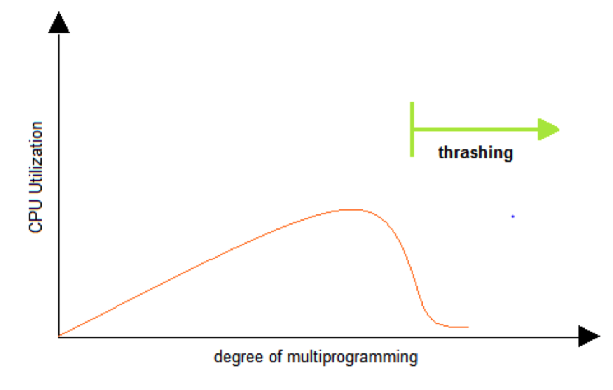

# 🔑 Page Replacement Algorithm

<br>

## 📌 page replacement policy

> どのページを物理メモリーから、保存媒体に下げるのですか？ - > Page Replacement ( Swapping ) Algorithm

● オペレーティングシステムが特定のページを物理メモリーに上げようとするんですが、物理メモリーが詰まっていたらどうですか。
```
○ 基本ページのうち一つを物理メモリから保存媒体へ下げます。
○ 新しいページを該当物理メモリ空間に載せます。
```

<br>

## 📌 FIFO

● First In First Out Page Replacement Algorithm
```
○ 一番早く 入ってきた ページを 下げましょう。
```

<br>

## 📌 OPT

● Optimal Page Replacement Algorithm
```
○これから一番長い間、使用しないページを降ろしましょう。
○一般OSでは実装できません
```

<br>

## 📌 LRU

● Least Recently Used Page Replacement Algorithm
```
○ 一番前に使用されたページを更新します。
○ OPT入れ替えアルゴリズムが実装できませんので、過去記録を基にチャレンジします。
```

<br>

## 📌 LFU

● Least Frequently Used Page Replacement Algorithm
```
○ 一番少なく使われたページを下げましょう。
```

<br>

## 📌 NUR

● Not Used Frequently Page Replacement Algorithm
```
○ LRUと同様、最近使われていないページから切り替える手法
○ 各ページごとに参照ビット（R）、修正ビット（M）を置く。（R、M）
  - (0, 0)、 (0, 1)、 (1, 0)、 (1, 1)の順にページを交代します。
```

<br>

## 📌 Thrashing

● 繰り返しページフォールトが発生して、過度にページの入れ替え作業が起こり、実際には何もできない状況<br>

<br>

<br>
<br>

---

📚 参考講義：[コンピューター工学専攻必須オールインワンパッケージOnline](https://fastcampus.co.kr/dev_online_cs)