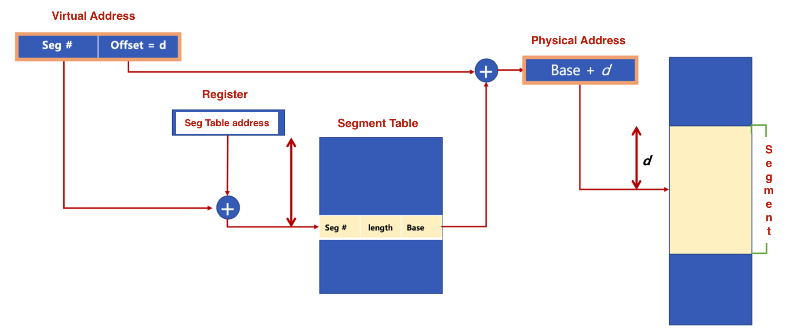
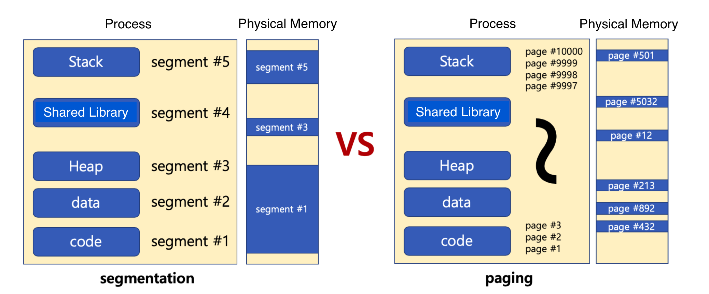

# 🔑 Segmentation

<br>

## 📌 segmentation technique - 1

● 仮想メモリを互いにサイズの異なる論理的単位であるsegmentに分割
```
○ ページング技法では仮想メモリを同じサイズの不録に分割します。
○ 例:x86リアルモードです。
  - CS(Code Segment), DS(Data Segment), SS(Stack Segment), ES(Extra Segment)に分けてメモリにアクセス
```

<br>

## 📌 segmentation technique - 2

● segment virtual address
```
○ v = (s、d): sはセグメント番号、dはブロック内セグメントの変位
```

<br>

<br>

## 📌 segmentation technique - 3

● segmentationはサイズの異なるsegment単位で物理メモリにローディング<br>

<br>

<br>

## 📌 参考

● 内部断片化 (paging)
```
○ ページブロックほどデータがぴったりと埋まっていない時の空間の無駄遣い
```
● 外部断片化 (segmentation)
```
○ 物理メモリーが望む連続サイズのメモリーを提供できない場合です。
```
● segmentation / paging みんなハードウェア支援が必要となります。
```
○ 様々なコンピュータシステムに移植性を重視するリナックスは、ページング技法を基に具現
```


<br>
<br>

---

📚 参考講義：[コンピューター工学専攻必須オールインワンパッケージOnline](https://fastcampus.co.kr/dev_online_cs)