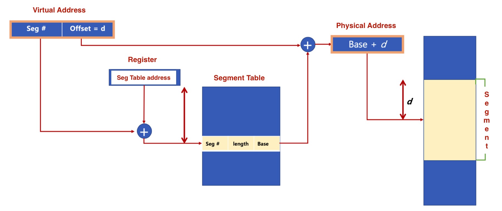
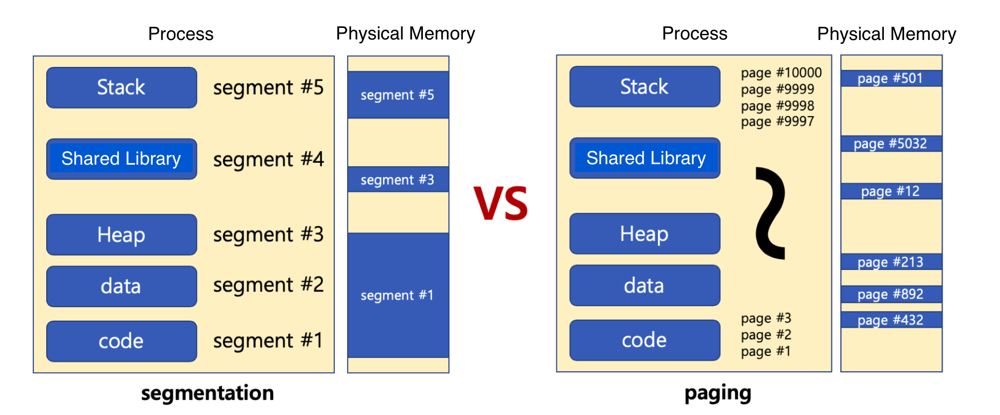

# 🔑 Segmentation

<br>

## 📌 segmentation technique - 1

● 가상 메모리를 서로 크기가 다른 논리적 단위인 segment로 분할
```
○ 페이징 기법에서는 가상 메모리를 같은 크기의 불록으로 분할
○ 예: x86 리얼모드
  - CS(Code Segment), DS(Data Segment), SS(Stack Segment), ES(Extra Segment)로 나누어 메모리 접근
```

<br>

## 📌 segmentation technique - 2

● segment virtual address
```
○ v = (s, d): s는 세그먼트 번호, d는 블록 내 세그먼트의 변위
```

<br>

<br>

## 📌 segmentation technique - 3

● segmentation은 크기가 다른 segment 단위로 물리 메모리에 로딩<br>

<br>

<br>

## 📌 참고

● 내부 단편화 (paging)
```
○ 페이지 블록만큼 데이터가 딱 맞게 채워져 있지 않을 때 공간 낭비
```
● 외부 단편화 (segmentation)
```
○ 물리 메모리가 원하는 연속된 크기의 메모리를 제공해주지 못하는 경우
```
● segmentation / paging 모두 하드웨어 지원 필요
```
○ 다양한 컴퓨터 시스템에 이식성을 중시하는 리눅스는 페이징 기법을 기반으로 구현
```

<br>
<br>

---

##### 📚 참고강의：[컴퓨터 공학 전공 필수 올인원 패키지 Online](https://fastcampus.co.kr/dev_online_cs)