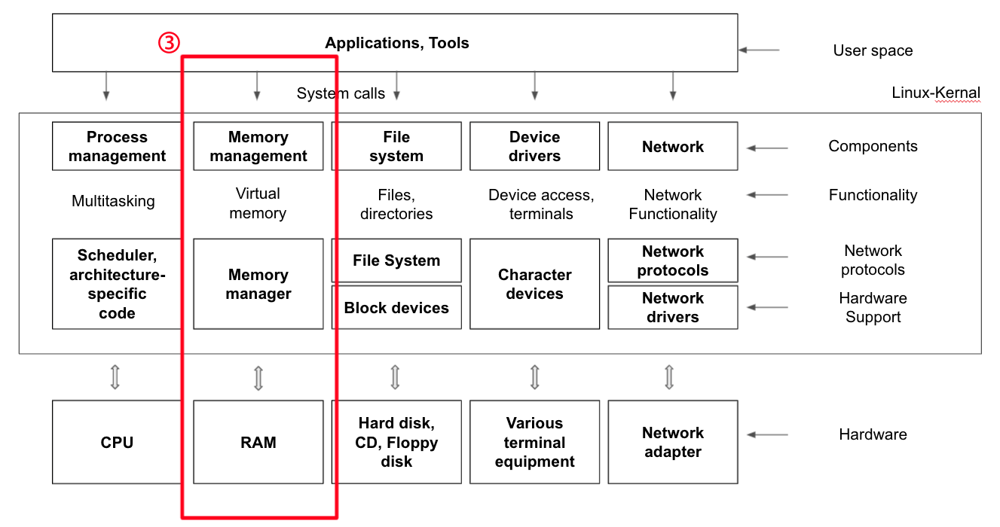

# Virtual Memory

 

 

## [🔗 Virtual Memory Basic Concept](5_1_virtual_memory_basic_concept)

 

## [🔗 Paging System](5_2_paging_system)

 

## [🔗 Paging System Strength](5_3_paging_system_strength)

 

## [🔗 Page Fault](5_4_page_fault)

 

## [🔗 Page Replacement Algorithm](5_5_page_replacement_algorithm)

 

## [🔗 Segmentation](5_6_segmentation)

 

