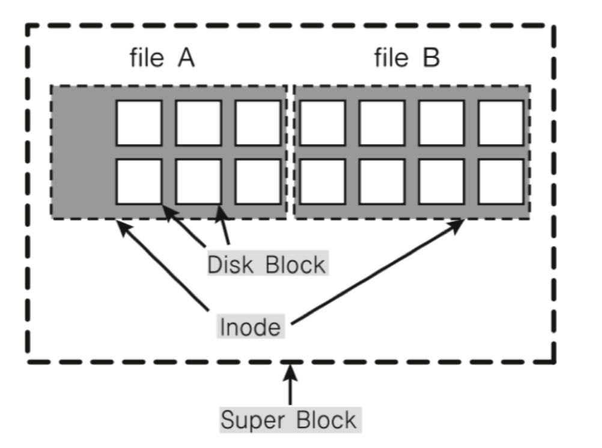
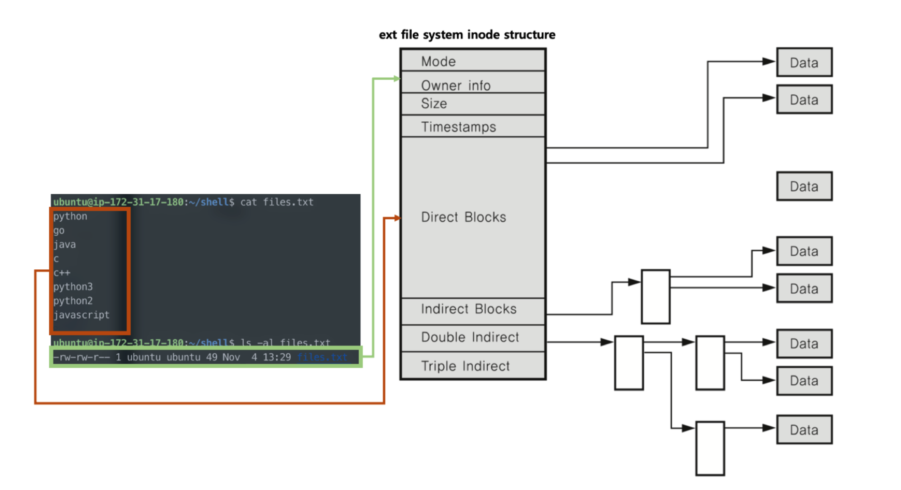
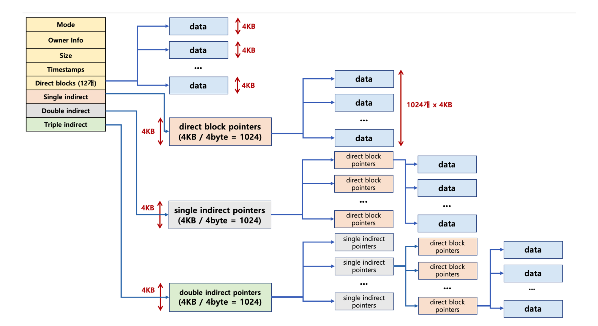

# 🔑 Inode and virtual file system

<br>

## 📌 inode file system

● ファイルシステムの基本構造
```
○ super block:ファイルシステム情報·パーティション情報を含みます
○ inode block:ファイル詳細情報
○ datablock:実際のデータ
```

<br>

## 📌 inode and file

● file:inodeの固有値と資料構造により主要情報を管理します。
```
○ ファイル名:inodeでファイル名はinode番号とのマッチングを行います
○ ファイルシステムではinodeに基づきファイルアクセスを行います
○ inodeに基づいたメタデータを保存します
```

<br>

<br>

## 📌 inode structure

● inodeベースのメタデータ(ファイル権限、所有者情報、ファイルサイズ、作成時間等、時間関連情報、データの保存場所等)


<br>

## 📌 inode structure and file



<br>

## 📌 inode structure and file data



<br>

## 📌 directory entry(dentry)

● Linux search file example: -/home/ubuntu/test.txt
```
○ 1.各ディレクトリエントリを探索（各エントリーは該当ディレクトリファイルディレクトリ情報を持っている）
○ 2. 「/」dentryで「home」を探し、「home」で「ubuntu」を探し、「ubuntu」で「test.txt」ファイル名に該当するinodeを取得
```

<br>

## 📌 virtual file system

● Networkなど様々な機器も同じファイルシステムインタフェースで管理可能<br>
● ex) readwriteシステムコール使用、各機器別read_specwrite_specコード実装(os内部)<br>


<br>

## 📌 linux(unix) os and virtual file system

● すべてはファイルという哲学に従います。
```
○ すべてのインターレクションはファイルを読み、書くようになっています
○ マウス、キーボードなどのあらゆるデバイスに関する技術もファイルと一緒に扱われます
○ 全ての資源の抽象化インタフェースでファイルインタフェースを活用します。
```

<br>
<br>

---

📚 参考講義：[コンピューター工学専攻必須オールインワンパッケージOnline](https://fastcampus.co.kr/dev_online_cs)