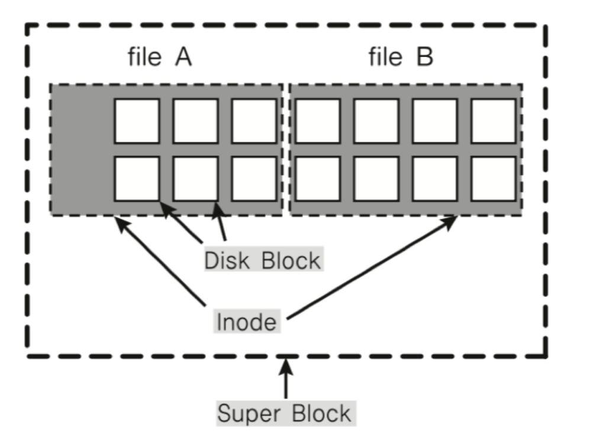
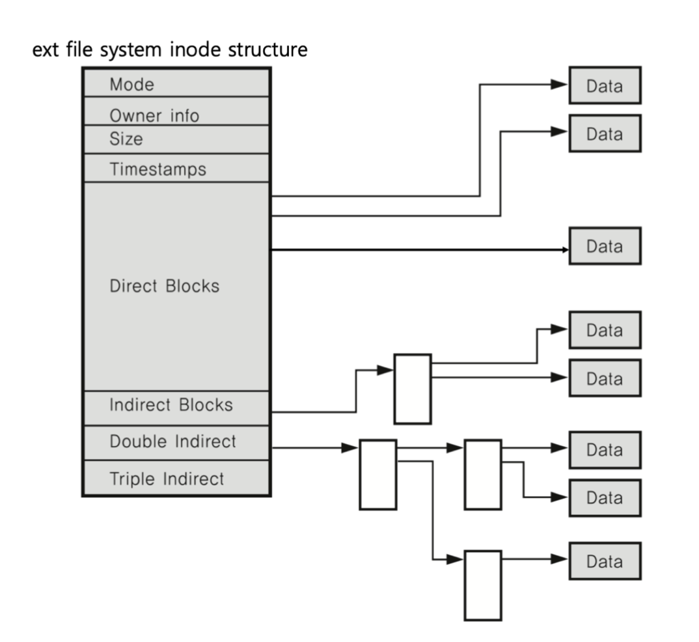
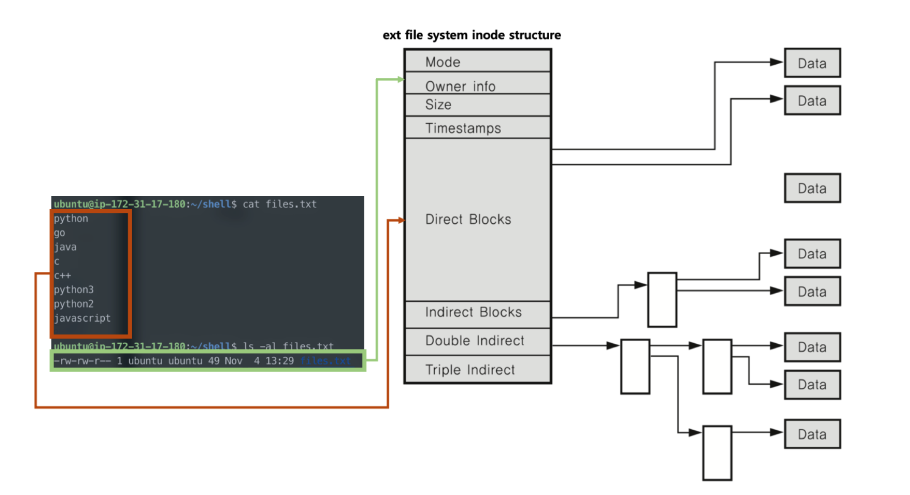
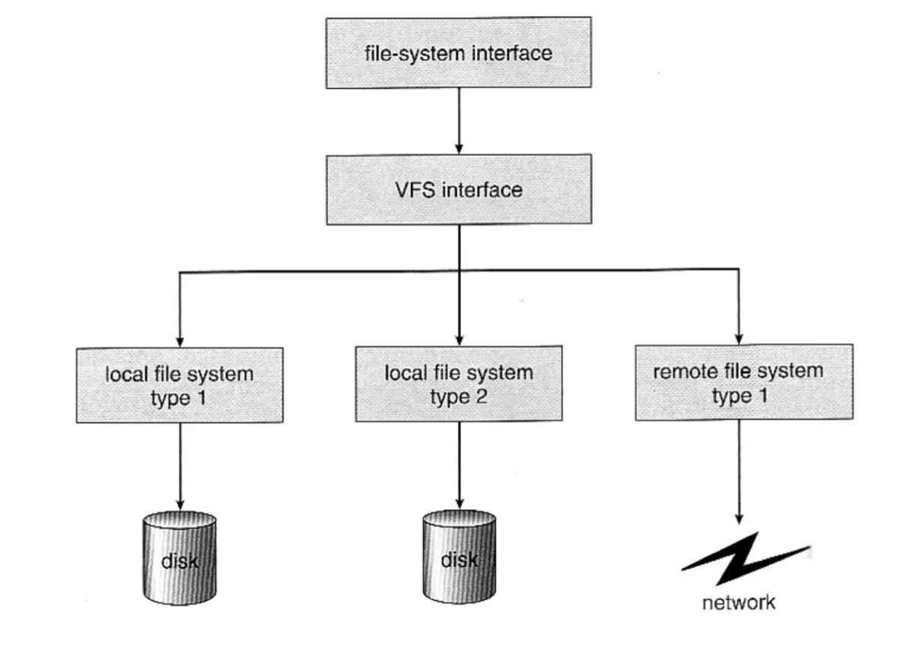

# 🔑 Inode And Virtual File System

<br>

## 📌 inode file system

● 파일 시스템 기본 구조
```
○ super block: 파일 시스템 정보 및 파티션 정보 포함
○ inode block: 파일 상세 정보
○ data block: 실제 데이터
```

<br>

## 📌 inode and file

● file: inode 고유값과 자료구조에 의해 주요 정보 관리
```
○ 파일이름: inode로 파일이름은 inode 번호와 매칭
○ 파일 시스템에서는 inode를 기반으로 파일 엑세스
○ inode 기반 메타 데이터 저장
```

<br>

<br>

## 📌 inode structure

● inode 기반 메타 데이터(파일 권한, 소유자 정보, 파일 사이즈, 생성시간등 시간 관련 정보, 데이터 저장 위치등)



<br>

## 📌 inode structure and file



<br>

## 📌 inode structure and file data


<br>

## 📌 directory entry(dentry)

● Linux search file example: -/home/ubuntu/test.txt
```
○ 1. 각 디렉토리 엔트리를 탐색(각 엔트리는 해당 디렉토리 파일/디렉토리 정보를 가지고 있음)
○ 2. '/' dentry에서 'home'을 찾고, 'home'에서 'ubuntu'를 찾고, 'ubuntu'에서 test.txt 파일이름에 해당하는 inode를 얻음
```

<br>

## 📌 virtual file system

● Network등 다양한 기기도 동일한 파일 시스템 인터페이스를 통해 관리 가능<br>
● ex) read/write 시스템콜 사용, 각 기기별 read_spec/write_spec 코드 구현(os 내부)<br>



<br>

## 📌 linux(unix) os and virtual file system

● 모든 것은 파일이라는 철학을 따름
```
○ 모든 인터렉션은 파일을 읽고, 쓰는 것처럼 이루어져있음
○ 마우스, 키보드와 같은 모든 디바이스 관련된 기술도 파일과 같이 다루어짐
○ 모든 자원에 대한 추상화 인터페이스로 파일 인터페이스를 활용
```

<br>
<br>

---

##### 📚 참고강의：[컴퓨터 공학 전공 필수 올인원 패키지 Online](https://fastcampus.co.kr/devonlinecs)