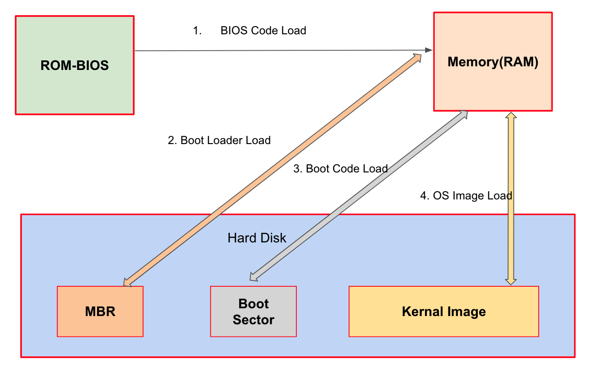

# 🔑 Booting

<br>

## 📌 what is file booting?

● 컴퓨터를 켜서 동작시키는 절차<br>
● Boot Program
```
○ os 커널을 Storage에서 특정 주소의 물리 메모리로 복사하고 커널의 처음 실행위치로 Program counter를 가져다 놓는 프로그램
```

<br>

## 📌 booting process

● if you turn the computer on?
```
○ BIOS가 특정 Storage 읽어와 bootstrap loader를 메모리에 올리고 실행함
○ bootstrap loader 프로그램이 있는 곳을 찾아서 실행시킴
```

<br>

<br>
<br>

---

##### 📚 참고강의：[컴퓨터 공학 전공 필수 올인원 패키지 Online](https://fastcampus.co.kr/devonlinecs)