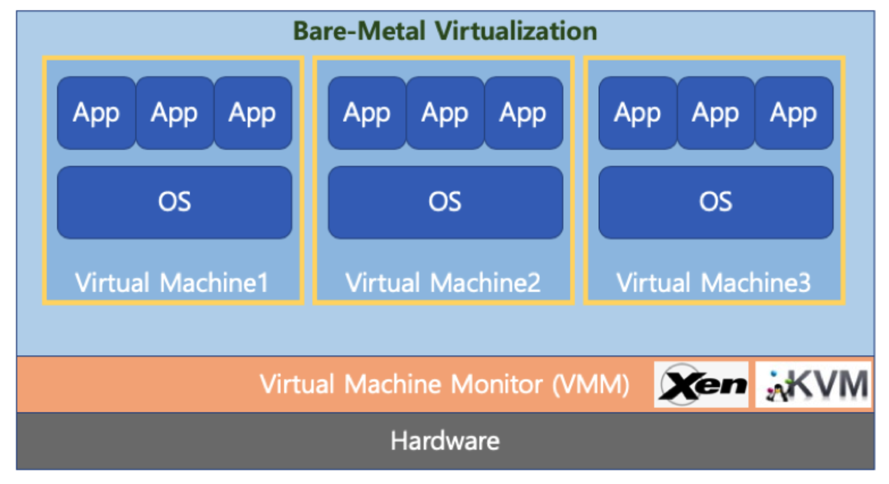
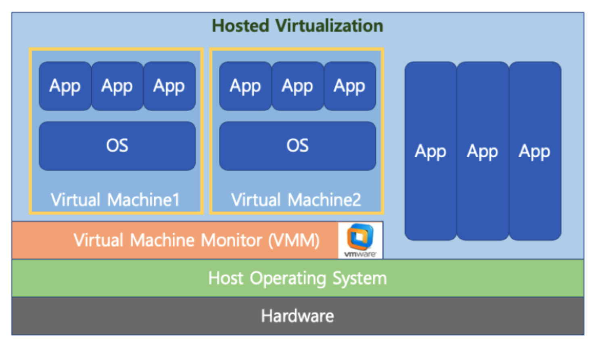
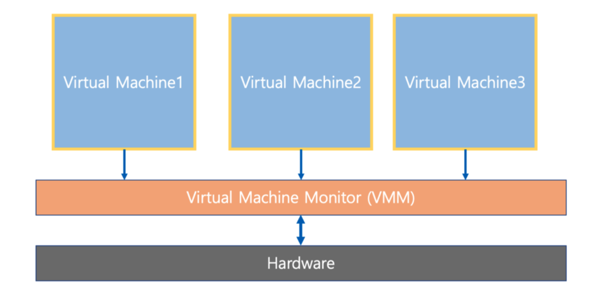
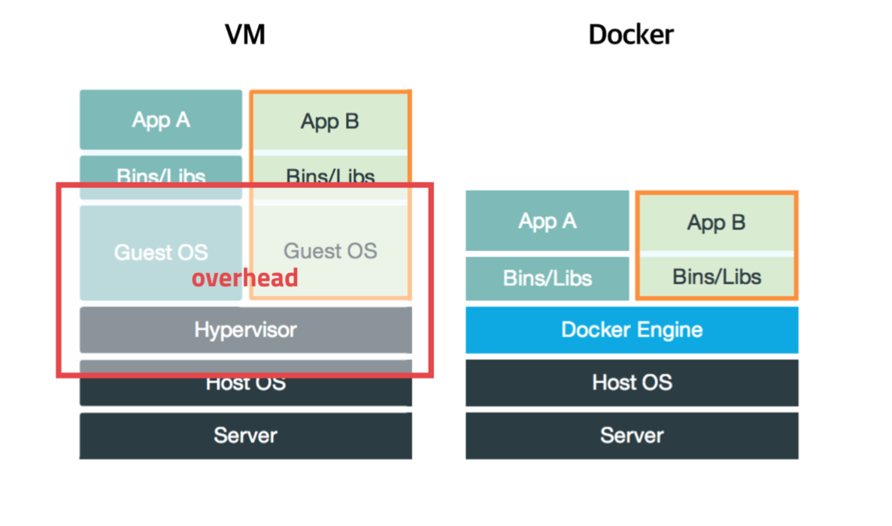
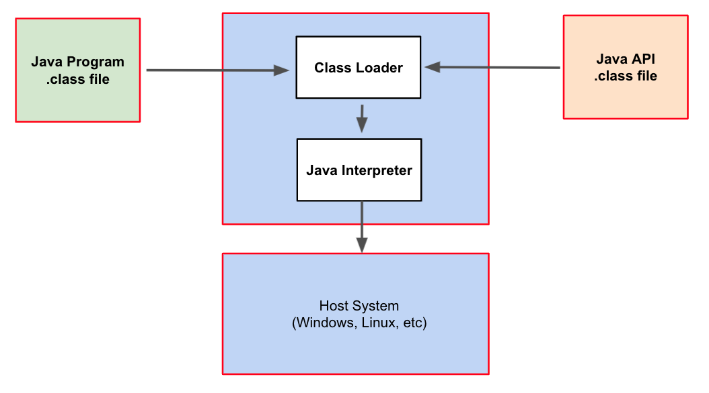

# 🔑 Virtual Machine

<br>

## 📌 what is file virtual machine?

● 1つのハードウェア(CPU、Memoryなど)に多数のOSをインストールし、個々のコンピュータのように動作できるようにするプログラム<br>

<br>

## 📌 virtual machine type1 (native or bare metal)

● hypervisor(or vmm): osとアプリケーションを物理的ハードウェアから分離するプロセス<br>
● hypervisorまたはvirtual machineというソフトウェアがハードウェアで直接駆動<br>
```
○ Xen, KVM
```

<br>

<br>

## 📌 virtual machine type2

● hypervisorまたはvirtual machineというソフトウェアをHost OS上位にインストールします。
```
○ VMWare, Parallels Desktop (Mac)
```

<br>

<br>

## 📌 full virtualization vs half virtualization

> 最近HWの性能を改善し、Full virtualization技術を好みます。

● full virtualization:各仮想マシンがhypervisorを通じてハードウェアと通信します。
```
○ hypervisorがまるでハードウェアのように動作するので、仮想マシンのOSは自分が仮想マシンである状態なのかを知りません。
```
● half virtualization:各仮想マシンから直接ハードウェアと通信します。
```
○ 各仮想マシンにインストールされるosは仮想マシンの場合、これを認知し、各コマンドにhypervisor命令を追加し、ハードウェアと通信
```

<br>

<br>

## 📌 VMWare

● VMWare:大衆的な仮想マシンプログラム(Type2)<br>

<br>

<br>

## 📌 KVM

● AWS(アマゾンクラウドコンピューティングサービス)などで使用(Type1)<br>
● Intel-VTなど仮想化機能を持つCPUでは、VMX rootVMX non-rootモードの存在<br>
● 各モードごとにprotection ring 0~3対応、仮想化機能を使用しない場合、VMX rootモード使用<br>
● KVMは各仮想システムに対応するKVMプロセス実行、KVMモジュール(devkvm)を通じてvCPU使用<br>
● KVMプロセス基盤のゲストカーネル(VMX non-root RING 0使用)、QEMU装置エミュレータがロードされた<br>
● ゲストカーネル上で実行されるアプリケーションは、VMX non-root RING3使用<br>
● ゲストカーネルが物理的HW資源が必要な場合、VM exitが発生、KVMモジュールで当該要請処理<br>
● 通常のHW資源はQEMU装置エミュレータで処理されます
```
○ QEMUデバイスエミュレータはVMX rootRING 3を通じてホストカーネルに要請した後、当該データは共有メモリーを通じてKVMゲストカーネルと共有します。
```

<br>

<br>

## 📌 Docker

● 仮想マシンは、コンピュータハードウェアを仮想化（ハードウェアの正体抽象化）します
```
○ hypervisor使用、追加os必要などの性能低下イシューが存在します。
```
● Dockerはosレベルから別途分離された実行環境を提供します。(kernal抽象化)
```
○ まるでLinuxを初めてインストールした時と似た実行環境を築いてくれるLinuxコンテナ技術基盤
○ リナックスコンテナ技術ですので、macOSやwindowsにインストールする場合は仮想マシン基盤を提供します
```

<br>

<br>

## 📌 virtual machine summary

● Bare-Metal方式が最も性能が良いです。
```
○ ハードウェアを直接アクセスするためです
○ AWS(Cloud Computing)環境もBare-Metal基盤の仮想マシン技術を活用(KVM)
```
● Dockerは軽量イメージで実行環境を丸ごとバックアップ·実行可能(実務に多く使用される)
```
○ Data EngineeringからDockerへシステム環境設定+プログラムを一度に配布します。
○ 例:プログラムアップデート -> Docker Image 作成 -> JenkionsでBatch Job 生成·実行(AWS EC2 再生性·Dockerイメージをインストール、実行)
```

<br>

## 📌 JVM(java virtual machine)

● 仮想マシンとは異なる目的（応用プログラムレベルの仮想化）<br>
● JavaコンパイラはCPU dependencyを持たないbytecodeを作成する<br>
● このファイルをJava Virtual Machineで実行する<br>
● 各osのためのJava Virtual Machineプログラム存在<br>

<br>

<br>
<br>

---

📚 参考講義：[コンピューター工学専攻必須オールインワンパッケージOnline](https://fastcampus.co.kr/dev_online_cs)