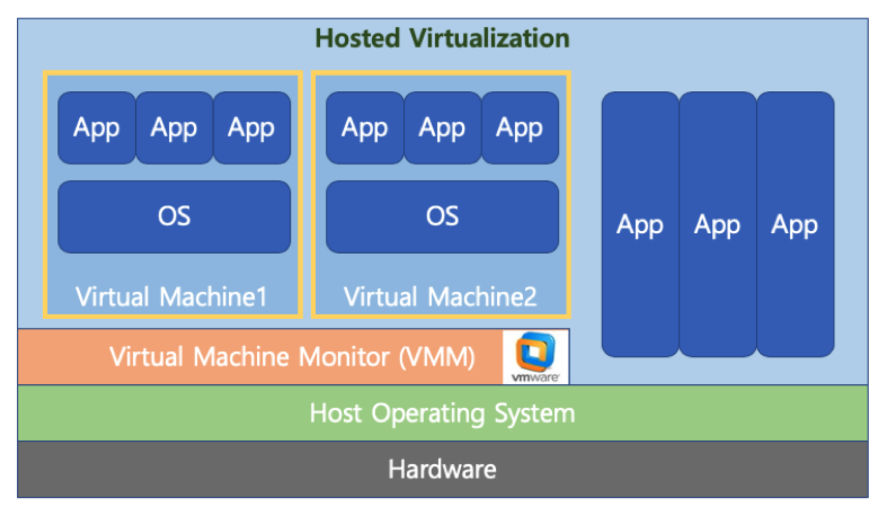
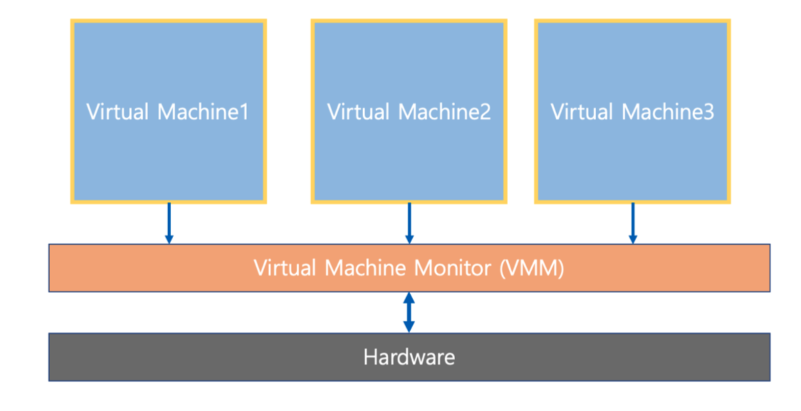
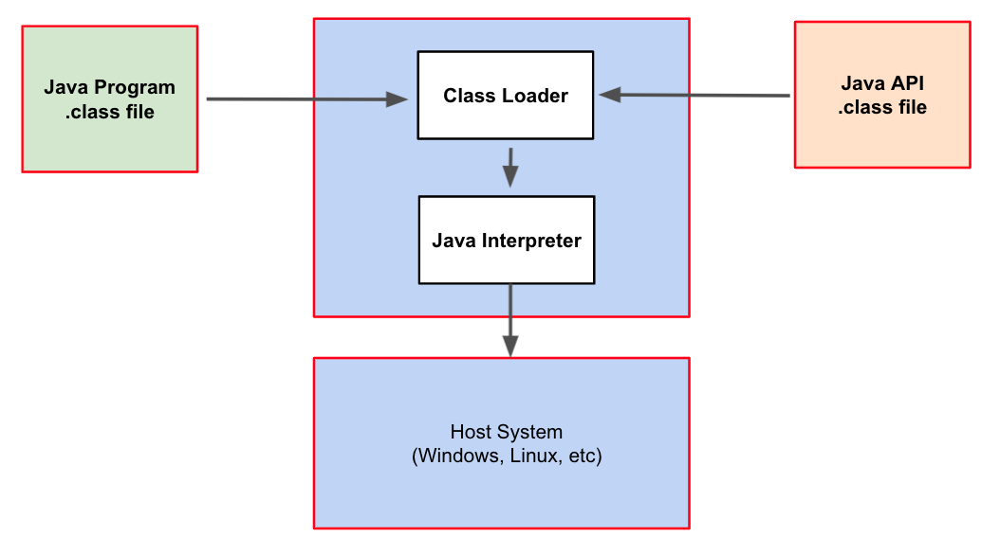

# 🔑 Virtual Machine

<br>

## 📌 what is file virtual machine?

● 하나의 하드웨어(CPU, Memory 등)에 다수의 운영체제를 설치하고, 개별 컴퓨터처럼 동작하도록 하는 프로그램<br>

<br>

## 📌 virtual machine type1 (native or bare metal)

● hypervisor(or vmm): os와 응용프로그램을 물리적 하드웨어에서 분리하는 프로세스<br>
● hypervisor 또는 virtual machine라고 하는 소프트웨어가 하드웨어에서 직접 구동<br>
```
○ Xen, KVM
```

<br>

<br>

## 📌 virtual machine type2

● hypervisor 또는 virtual machine라고 하는 소프트웨어가 Host OS 상위에 설치
```
○ VMWare, Parallels Desktop (Mac)
```

<br>

<br>

## 📌 full virtualization vs half virtualization

> 최근 HW 성능 개선으로 full virtualization 기술을 선호

● full virtualization: 각 가상머신이 hypervisor를 통해서 하드웨어와 통신
```
○ hypervisor가 마치 하드웨어인 것처럼 동작하므로, 가상머신의 OS는 자신이 가상 머신인 상태인지를 모름
```
● half virtualization: 각 가상머신에서 직접 하드웨어와 통신
```
○ 각 가상머신에 설치되는 os는 가상 머신인 경우, 이를 인지하고, 각 명령에 hypervisor 명령을 추가해서 하드웨어와 통신
```

<br>

<br>

## 📌 VMWare

● VMWare: 대중적인 가상머신 프로그램(Type2)<br>

<br>

<br>

## 📌 KVM

● AWS(아마존 클라우드 컴퓨팅 서비스)등에서 사용(Type1)<br>
● Intel-VT등 가상화 기능을 가진 CPU에서는 VMX root/VMX non-root 모드 존재<br>
● 각 모드별로 protection ring 0 ~ 3 지원, 가상화 기능을 사용하지 않을 경우, VMX root 모드 사용<br>
● KVM은 각 가상 시스템에 대응하는 KVM 프로세스 실행, KVM 모듈(/dev/kvm)을 통해 vCPU 사용<br>
● KVM 프로세스 기반 게스트 커널(VMX non-root / RING 0 사용), QEMU 장치 에뮬레이터가 로드됨<br>
● 게스트 커널 위에서 실행되는 응용 프로그램은 VMX non-root / RING3 사용<br>
● 게스트 커널이 물리적 HW 자원 필요시, VM exit가 발생, KVM 모듈에서 해당 요청 처리<br>
● 일반 HW 자원은 QEMU 장치 에뮬레이터에서 처리
```
○ QEMU 장치 에뮬레이터는 VMX root / RING 3를 통해, 호스트 커널에 요청 후, 해당 데이터는 공유 메모리를 통해 KVM 게스트 커널과 공유
```

<br>

<br>

## 📌 Docker

● 가상 머신은 컴퓨터 하드웨어를 가상화 (하드웨어 정체 추상화)
```
○ hypervisor 사용, 추가 os 필요등 성능 저하 이슈 존재
```
● Docker는 os 레벨에서 별도로 분리된 실행환경을 제공 (kernal 추상화)
```
○ 마치 리눅스 처음 설치했을때와 유사한 실행환경을 만들어주는 리눅스 컨테이너 기술 기반
○ 리눅스 컨테이너 기술이므로 macOS나 windows에 설치할 경우는 가상 머신 기반 제공
```

<br>

<br>

## 📌 virtual machine summary

● Bare-Metal 방식이 가장 성능이 좋음
```
○ 하드웨어 직접 엑세스하기 때문
○ AWS(Cloud Computing) 환경도 Bare-Metal 기반 가상 머신 기술을 활용(KVM)
```
● Docker는 경량 이미지로 실행환경을 통째로 백업, 실행 가능(실무에 많이 사용됨)
```
○ Data Engineering에서 Docker로 시스템 환경 설정 + 프로그램을 한번에 배포
○ 예: 프로그램 업데이트 -> Docker Image 작성 -> Jenkions로 BatchJob 생성 및 실행(AWS EC2 재생성 및 Docker 이미지 설치, 실행)
```

<br>

## 📌 JVM(java virtual machine)

● 가상 머신과는 다른목적 (응용프로그램 레벨 가상화)<br>
● Java 컴파일러는 CPU dependency를 가지지 않는 bytecode를 생성함<br>
● 이 파일을 Java Virtual Machine에서 실행함<br>
● 각 os를 위한 Java Virtual Machine 프로그램 존재<br>

<br>

<br>
<br>

---

##### 📚 참고강의：[컴퓨터 공학 전공 필수 올인원 패키지 Online](https://fastcampus.co.kr/devonlinecs)