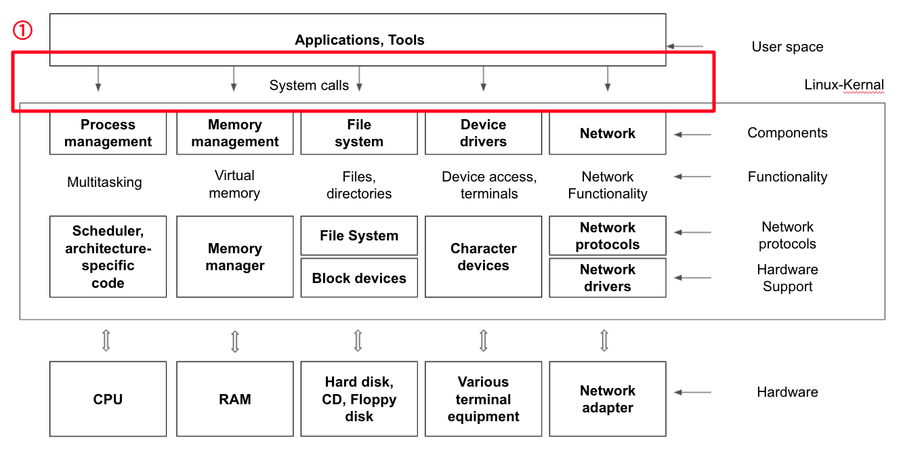

# System Call

 

 1. 시스템 콜 또는 시스템 호출 인터페이스
  
 システムコールまたはシステム呼び出しインタフェース
   
 2. 운영체제가 운영체제 각 기능을 사용할 수 있도록 시스템 콜이라는 명령 또는 함수를 제공
  
 オペレーティングシステムが運営システムの各機能を使用できるようシステムコールという命令または関数を提供
   
 3. API 내부에는 시스템콜을 호출하는 형태로 만들어지는 경우가 대부분
  
 API内部にはシステムコールを呼び出す形で作られる場合がほとんど